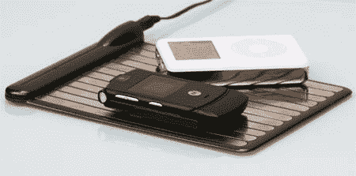

# 无线充电

> 原文：<https://web.archive.org/web/http://techcrunch.com:80/2007/07/08/wildcharger-charges-wirelessly/>

# WildCharger 无线充电

WildCharge 终于行动起来，第一个无线充电站 [RAZR、](https://web.archive.org/web/20201204182613/https://crunchbase.com/organization/razr) 将于本月发布。这是一个相当奇怪的设计，但我猜'无线'充电方面很酷？这实际上听起来像一个复杂的过程，我不太确定它是否值得你支付 89.99 美元。

如果你想冒险，那就把手机背面拿下来，放在充电板上。一旦你的 RAZR 在 pad 上，你就必须将 pad 的充电臂连接到手机的电源端口。听起来很简单不是吗？我想是的。这听起来对任何人有吸引力吗？这怎么会是革命性的或无线的呢？

[产品页面](https://web.archive.org/web/20201204182613/http://www.wildcharge.com/index.cfm/fuseaction/product.display/Product_ID/486/Motorola_RAZR_WildCharge_Adapter.htm)