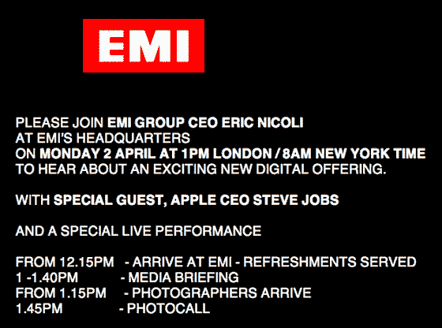

# DRM 今天会死吗？

> 原文：<https://web.archive.org/web/http://www.techcrunch.com:80/2007/04/02/will-drm-die-today/>

***更新:** [这是现在确认的](https://web.archive.org/web/20230123030530/http://techcrunch.com/2007/04/02/emi-apple-are-announcing-sale-of-non-drm-music/)。百代通过 iTunes 免费提供其全部数字音乐目录。歌曲每首 1.29 美元。*

DRM 今天会死吗？五个小时后我们就会知道了。伦敦时间今天下午 1 点，百代首席执行官埃里克·尼科利和苹果首席执行官史蒂夫·乔布斯将召开 40 分钟的新闻发布会。今天早上许多媒体被邀请参加，但除了“听到一个令人兴奋的新数字产品”之外，没有发布任何信息。

不过，华尔街日报似乎知道得更多一些。他们[说](https://web.archive.org/web/20230123030530/http://online.wsj.com/article/SB117547255583356319.html?mod=hpp_europe_at_glance_technology)(在付费墙后面)这两家公司将宣布百代唱片目录的很大一部分将在没有任何数字版权管理的情况下在线销售。百代是仅次于环球和索尼的第三大音乐品牌。

像 DRM 这样的标签是因为用户不能轻易复制歌曲送给朋友。用户讨厌 DRM，因为他们被锁定在一个设备或服务上。今年早些时候，乔布斯给唱片公司写了一封公开信，呼吁他们“彻底废除数字版权管理”。他在信中指出，普通 iPod 上每 1000 首歌曲中只有 22 首是从 iTunes 上购买的，不到 3%。其余的都是从 CD 上撕下来非法获得的。

鉴于免费获得无 DRM 的音乐的非法服务太多，充满 DRM 的在线数字音乐销售增长不够快，不足以抵消 CD 销售的下降，CD 销售在去年下降了 20%。每月有 10 亿首歌曲从 P2P 网络下载，其中大部分是非法的。

如果百代确实宣布他们将出售没有 DRM 的音乐，乔布斯将得到大部分或全部的荣誉。如果销量增加，预计其他三大唱片公司也会加入。2007 年 4 月 2 日将是乐迷们永远记住的一天。

更多关于[嘎吱齿轮](https://web.archive.org/web/20230123030530/http://crunchgear.com/2007/04/02/emi-selling-drm-free-music/)的信息。