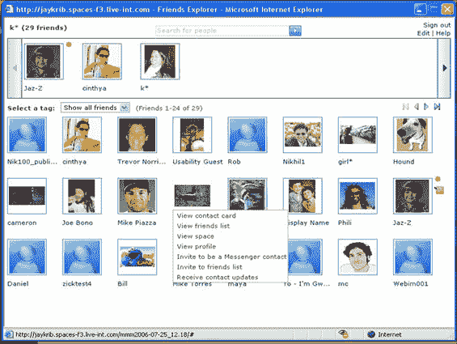
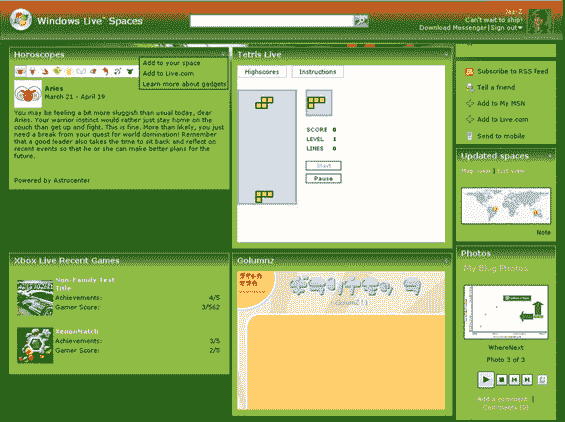

# Windows Live Spaces 发布，取代 MSN Spaces 

> 原文：<https://web.archive.org/web/http://www.techcrunch.com:80/2006/08/01/windows-live-spaces-launches-replaces-msn-spaces/>

# Windows Live Spaces 启动，取代 MSN Spaces

  太平洋标准时间今晚 9 点，微软将[宣布](https://web.archive.org/web/20221128184005/http://thespacecraft.spaces.live.com/blog/cns!8AA773FE0A12B9E3!22751.entry?_c=BlogPart#permalink)推出 [Windows Live Spaces](https://web.archive.org/web/20221128184005/http://spaces.live.com/) ，这是一个 Live.com 平台上的博客和社交网站。

随着微软逐步淘汰 MSN 品牌以支持 Live.com，他们已经一次一个地将服务转移到新的平台上。然而，与 Windows Live Messenger 不同的是，[与 MSN Messenger 并行运行](https://web.archive.org/web/20221128184005/http://www.beta.techcrunch.com/2006/05/08/live-messenger-opens-to-public/)，Live Spaces 完全接管了 MSN Spaces pages 页面现在重定向到 Live Spaces URLs。这是一个不小的决定，因为 MSN Spaces 目前是最大的博客平台，月访问量超过 1 亿。

Live Spaces 是一个比 MSN spaces 更好的平台，假设它同样稳定的话。有两个关键的新功能。

第一个是可以添加到空间的好友模块。然后用户邀请朋友，他们将出现在网站上。点击 messenger 图标也将启动与该朋友的 IM 会话。再点击一下，你就可以看到你朋友的所有朋友，扩大了你的社交网络(也增加了微软的浏览量)。这最后一个功能被称为朋友浏览器-见下面的第一个大截图。

第二，[Live.com 的小工具](https://web.archive.org/web/20221128184005/http://gallery.live.com/)现在可以通过点击添加到共享空间。下面的最后一个屏幕截图显示了一个共享空间站点上的一些小工具。

Live.com 空间仍然没有 Myspace 或 have the music angle 那么“酷”,但它是一个灵活得多的平台，拥有庞大的会员基础(尤其是在亚洲),而且这个基础还在快速增长。几个月后看看 comscore 的数据会很有意思，看看它会产生什么样的增长。

