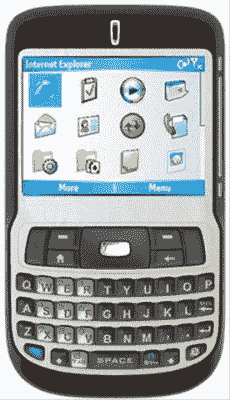

# Windows Media 6 升级现可用于 T-Mobile Dashers | TechCrunch

> 原文：<https://web.archive.org/web/http://techcrunch.com:80/2007/05/04/windows-media-6-upgrade-now-available-for-t-mobile-dashers/>

简单提一下:如果你使用 T-Mobile Dash，你应该去 T-Mobile WM 升级页面下载免费的 Windows Mobile 6 软件包。虽然它没有解决 WinMo 的所有问题(它仍然是 Windows)，但它在使它更可用和更直观方面还有很长的路要走。而且是免费的。我们喜欢免费的。

确保对你的 Dash 进行同步和完整备份，因为升级会把所有东西都抹掉。你会失去你的 Yahtzee！分数。我们知道，我们感受到了痛苦。

[T-Mobile Windows Mobile 升级页面](https://web.archive.org/web/20160421093650/http://www.t-mobile.com/wmupgrade/)