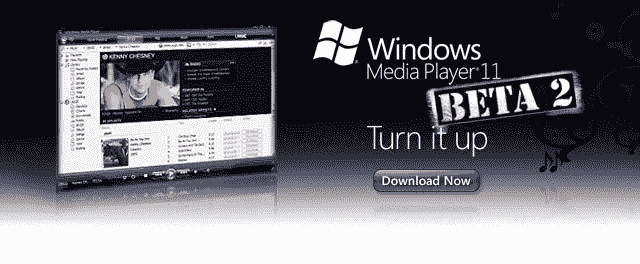

# windows Media Player 11 Beta 2 

> 原文：<https://web.archive.org/web/http://techcrunch.com/2006/09/01/windows-media-player-11-beta-2/>

带有 MTV 音乐服务的 Windows Media Player 11 Beta 2 现在可以从[下载](https://web.archive.org/web/20160420160252/http://www.microsoft.com/windows/windowsmedia/player/11/default.aspx)。如果你运行的是 WMA 11 Beta 1，你可能会尽快得到这个。Beta 2 特性:

> 修复问题。针对 Windows XP 的 Windows Media Player 11 第一个测试版中出现的问题进行了修复。
> 
> 其他在线商店现已推出。Windows XP 的 Windows Media Player 11 测试版提供了更多在线商店。有关现在可用的在线商店的列表，请参阅在线商店的可用性。
> 
> 对共享数字媒体内容的更改。Windows Media Connect 的功能现在作为新的媒体共享功能集成到 Windows XP 的 Windows Media Player 11 Beta 2 中，使您可以在家中的任何地方欣赏 Windows Media Player 库中的内容。如果您有家庭网络(有线或无线)，您可以使用 Windows Media Player 11 将您的媒体库内容流式传输到联网设备，如 Xbox 360 或其他数字媒体接收器。有关更多信息，请访问家庭数字媒体。

希望它比以前的版本运行得更好，或者至少比 iTunes 更好。

[WMA Beta 2](https://web.archive.org/web/20160420160252/http://blog.seanalexander.com/PermaLink,guid,65a77b0d-2eab-4453-9b14-7f74dd1c1a38.aspx) 【沉迷于数字媒体】