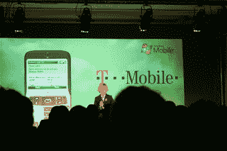

# Windows Mobile 6:直截了当的毒品——TechCrunch

> 原文：<https://web.archive.org/web/http://techcrunch.com:80/2007/02/12/windows-mobile-6-the-straight-dope/>

# Windows Mobile 6:直男

我们对 Windows Mobile 6 了解多少？首先，T-Mobile Dash 将在美国推出其他产品之前推出，Cingular 也将推出，但目前还没有关于哪些手机将运行它的真实信息。

Dash 是 T-Mo 的首款 WinMo 6 智能手机
新版本中解决了我们大部分的烦恼。WinMo 5 是如此糟糕——上周我试着用了几天，尽管我的助手在很大程度上搞砸了，我还是回到了 Danger OS——这就是它有多糟糕。

真正的改进是在信息和搜索方面。首先，在电子邮件菜单中有一个专用的删除按钮，这是一件大事。如果你尝试过用 WinMo 5 删除，你就会知道这是一个需要三个不同操作的模拟练习。现在你只需点击一个菜单键。Exchange 服务器内外都有全文搜索，这意味着您可以扫描*远程*服务器获取信息。很有意思。

电子邮件现在包括内联 HTML 查看，以及每封邮件的一次点击选项，大大减少了点击次数。WinMo 上也有 Office 的“可用”版本。

日历也略有改进，增加了许多不同的视图，包括标准的 Outlook 或 iCal“一周一览”视图，在活动期间显示大块。

WinMo 6 还将支持 VoIP 以及改进的移动调制解调器处理功能，以便在无线互联网陷入困境的时候(如贸易展)使用。

black jaq 4

它还包括集成的 MSN Live messaging，在联系人记录中带有小通知图标，并包括 Live search，带有高分辨率地图搜索以及交通信息。微软还推出了一项名为“谁在乎?”的数字版权管理技术。这只是另一种 DRM 技术。