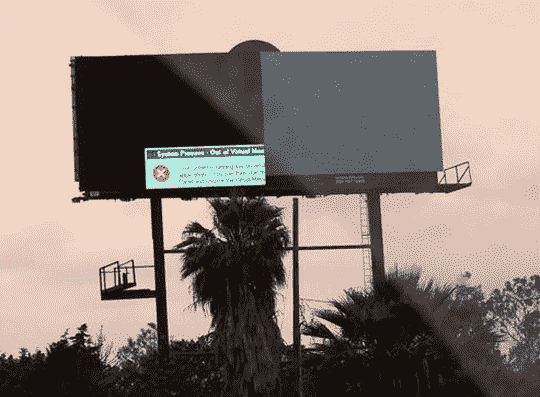

# Windows Vista:近距离个人| TechCrunch

> 原文：<https://web.archive.org/web/http://techcrunch.com/2007/06/08/windows-vista-up-close-personal/>

# Windows Vista:近距离、个性化

Ars Technica 正在发表一篇关于 Vista 内部的文章。正如我之前提到的，我喜欢 Vista，我认为它是一款好产品。我大约有两个月没有使用它了，但是那不是这里也不是那里。然而，我确实喜欢好的“幕后”故事。谁没有呢？

显然，这里没有什么是我们不知道的——UAC 让我们安全，比尔·盖茨是爱——但是把这一切都集中在一个地方还是很好的。干得好，阿瑞斯。
[Windows Vista:引擎盖下](https://web.archive.org/web/20130628194522/http://arstechnica.com/reviews/os/vista-under-the-hood.ars)【ArsTechnica】