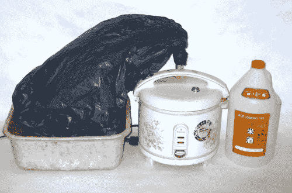

# 酒鬼们欢呼吧！你电饭煲里的酒精！–TechCrunch

> 原文：<https://web.archive.org/web/http://techcrunch.com/2007/01/30/winos-rejoice-alcohol-from-your-rice-cooker/>

# 酒鬼们欢呼吧！你电饭煲里的酒精！

作为 CrunchGear 的众多常驻酒鬼之一，我觉得我有责任向你展示以下 DIY 玩意儿。似乎有一位可爱的绅士能够将一个电饭锅和一个塑料垃圾袋装配在一起，这样他就可以生产一种以大米为原料的料酒。这篇文章非常详细地解释了为了在你的领域里建立并运行一个地下酒吧，你需要做些什么。所以孩子们，请记住:如果有一天你感到无聊了，你可以用一点创意和一大堆米饭为你的父亲做一份便宜又简单的父亲节礼物。

[垃圾袋+电饭锅=酒精蒸馏器](https://web.archive.org/web/20201022182330/http://www.instructables.com/id/ENN80BO7B5EXCFGX2J?ALLSTEPS)【通过[制造](https://web.archive.org/web/20201022182330/http://www.makezine.com/blog/archive/2007/01/garbage_bag_ric.html?CMP=OTC-0D6B48984890)