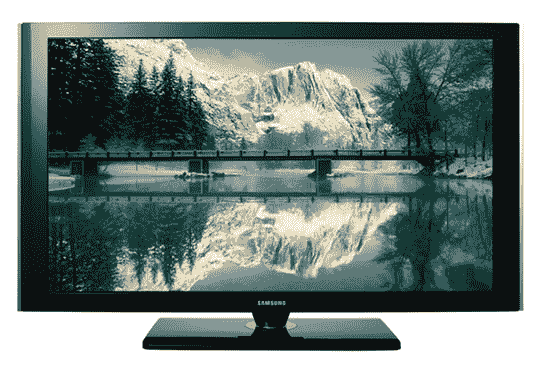

# 无线等离子电视便于壁挂安装| TechCrunch

> 原文：<https://web.archive.org/web/http://techcrunch.com:80/2007/07/12/wireless-plasma-tv-for-easy-wall-mounting/>

无线等离子电视？现在我都看到了。

实际上，我还没有**也没有**见过这一切，但这种创新让像我这样一个厌倦了电子设备的老用户从无精打采变成几乎坐直了。

三星 94 系列等离子电视只配有一根电源线，吸引你乘坐子弹头列车到壁挂连接处。一个内置的 802.11n 连接与一个隐藏的接收器通信，该接收器位于 200 英尺远的一堆难看的电线中。

> 消费者可以将各种家庭影院组件连接到接收器，只留下 HDTV 的电源线隐藏起来，而不是将各种家庭影院组件插入 HDTV 的背面，如蓝光/DVD 播放器、盒中家庭影院系统和电缆盒。该接收器的覆盖范围可达 200 英尺，可将音频和视频信号(高达 1080i 高清分辨率)直接无线传输至电视机。该接收器具有多种连接选项，可轻松扩展家庭影院，包括三个采用 CEC 技术的 HDMI 1.3 端口。使用内置的 NTSC/ATSC/QAM 数字调谐器可以观看无线高清电视频道。

我永远也买不起这种美，但希望更多像这样的电视能以更低的价格进入市场。

它们将在今年年底推出 50 英寸和 58 英寸的版本，售价分别为 3599 美元和 5299 美元。

[三星无线等离子电视新闻稿(PDF 文件)](https://web.archive.org/web/20160515145119/http://product.samsung.com/holidayinjuly2007/dl/press_CED/Plasma.pdf)