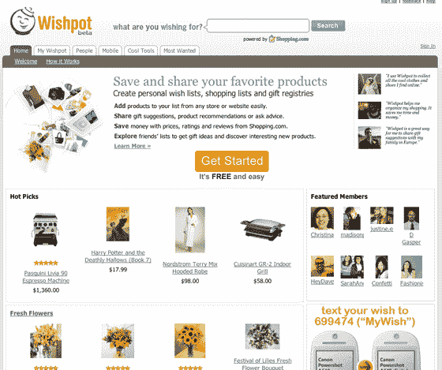

# Wishpot:社交购物走向移动化

> 原文：<https://web.archive.org/web/http://www.techcrunch.com:80/2007/07/01/wishpot-social-shopping-goes-mobile/>

 社交购物网站 [Wishpot](https://web.archive.org/web/20160416112052/http://www.wishpot.com/) 本周推出了一款产品，旨在将社交购物扩展到实体世界。

Wishpot 的移动支持允许用户通过从他们的移动电话向 Wishpot 发送文本消息或图片来保存和共享他们找到的所有“有趣的东西”。在线时，用户可以查看保存的商品，研究价格，查看评分和评论，向朋友征求意见或分享建议。

这种轻松保存、研究和推荐产品的能力是一种有趣的产品，尽管将“社交购物”的概念扩展到线下世界肯定有某种程度的讽刺；我本以为朋友会填补当地购物中心的社交空白。

Wishpot 与 [Kaboodle](https://web.archive.org/web/20160416112052/http://www.techcrunch.com/tag/kaboodle) 、 [Stylehive](https://web.archive.org/web/20160416112052/http://www.techcrunch.com/2006/04/20/stylehive-is-looking-good/) 、[雅虎购物圈、](https://web.archive.org/web/20160416112052/http://www.techcrunch.com/2005/11/14/yahoo-shoposphere-launches-tonight/)、 [Zlio](https://web.archive.org/web/20160416112052/http://www.techcrunch.com/2007/05/21/zlio-banned-from-amazon/) 和 [MyPickList 在同一个空间竞争。](https://web.archive.org/web/20160416112052/http://www.techcrunch.com/tag/mypicklist)

如果你是一个购物狂，喜欢一个好品牌，并告诉每个人它，你可能会喜欢 Wishpot。
