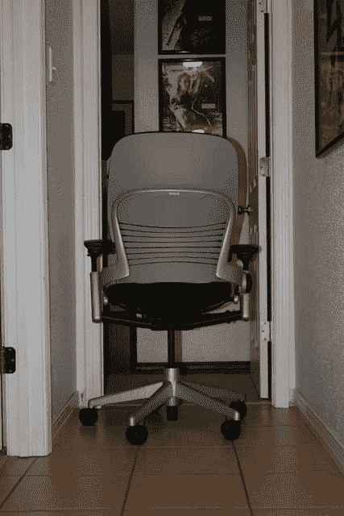

# 工作区综述:符合人体工程学的椅子

> 原文：<https://web.archive.org/web/http://techcrunch.com:80/2006/12/28/workspace-roundup-ergonomic-chairs/>

作为技术人员，没有什么比椅子对我们的影响更大了。每天坐在椅子上无数个小时对我们的身体有显著的影响。一把蹩脚的椅子会导致即刻的压力，也会导致长时间的疼痛。然而，一把高质量的椅子可以给你带来很多好处。

适当的腰部支撑、合理的可调节性、足够的填充物，所有这些都在你坐着时身体吸收的压力中发挥作用。获得一个合适的座位应该不是一件难事，但这似乎是许多人忽视的价值。

在这篇文章中，我们了解了 ergo 椅市场的一些主要参与者。很少有更好的选择，因此也很少有更贵的。但我们相信，如果这些椅子超出了你的价格范围，目前的功能可以作为你购买个人现实的替代品的指南。

 **[steel case Leap](https://web.archive.org/web/20220819063247/http://store.steelcase.com/ProductDetails.asp?ProductCode=46216179)**
**价格:** $900 所示——800 元基础

在我们的列表中名列前茅的是 Steelcase 的飞跃。被广泛吹捧为 Aeron 杀手的 Leap 具有人们在 ergo 椅子上可能要求的一切功能。这款椅子有 10 个可调点，很容易根据个人需求精确定位。

这些控件允许您操纵座椅深度和高度、腰部高度、下背部和上背部硬度、倾斜度和臂垫的各种选项。它是皮革的，但我演示了一个布的版本，它比皮革更吸引我。

从建造角度来看，它感觉像是 50 年代的东西。它很重，而且相当重——当我兴奋地要把它从箱子里拿出来时，我扭着背，在接下来的几天里一瘸一拐地走着，这是一个甜蜜的讽刺。

飞跃过程中人体工程学选项的数量之多，一开始可能会有点令人生畏。毫无疑问，我花了几天时间最终让它处于一种令人愉快的状态，然后又花了几天时间将其调整到完美。

但是在里面坐了大约两个星期后，我很好奇在那之前我是怎么生活的。我整个身体都感觉快乐了很多。

让我们面对现实吧，每个人都是千差万别的，对一个人适用的椅子可能对另一个人不适用。钢壳覆盖了它的基地。通过允许用户微调椅子的所有功能，它基本上创造了一个为每个人量身定制的椅子。

下行？成本。它不便宜，但是它非常值得。你可能必须卖肾才能买得起，但你的脖子和后背会感谢你的(至少在你从肾脏摘除中痊愈后)。–BR

**[HumanScale Liberty](https://web.archive.org/web/20220819063247/http://www.humanscale.com/products/liberty.cfm)**
**价格:** $885 起

当上面传来消息说我将重新审视我选择的符合人体工程学的椅子时，我决定走一条与我在 Gear 的同事们略有不同的道路。大多数符合人体工程学的椅子倾向于类似于星际战斗机座舱中的椅子。它们往往是轻率的、看起来像科幻的事情，有着比可能需要的更多的旋钮，以及适合吉格梦想的技术机械风格。当我发现由 HumanScale 的人制作的自由椅时，我知道我有了我的偶像破坏者。

看起来更像你在办公室里找到的东西，Liberty 就像椅子一样简单，但功能齐全，工作出色。虽然我相信椅子是椅子是椅子，但我现在觉得人类工程学毕竟有一席之地。坐在椅子上的感觉和其他任何东西都一样，除了你会有舒适的斜倚感，即使是直着坐着。对于像我这样有着 90 岁老奶奶体态的人来说，这很重要。高度调节旋钮是这把精致椅子上几个调节器中唯一可见的，它可以轻松地将我调整到适合我桌子的高度。我试了一下有三张桌子的椅子，它能很好地处理它们。

一个我以前从未见过(但现在在 ergo 椅子上很常见)的好特点是滑动座椅。坐垫向前或向后滑动，以更好地适应您的姿势，减轻您下背部的压力。如果你同样坐着或躺着，网眼靠背可以支撑你的背部。我注意到的一个特点是，当我看着电脑屏幕并斜躺着时，屏幕保持在眼睛的高度。我的头部高度变化很小，这的确是一个很棒的技巧，视频编辑可能会很喜欢。

椅子的控制相对简单，我只数了三个可调设置，但这就是你需要的。在我试过这把椅子的四个人中，所有人都能够通过这些控制使它完全适合他们；其余的会自动调整。

这把椅子唯一的缺点是有脚轮。如果你的办公室和我的一样，你的桌子下面到处都是电缆和电线，从电脑、小配件、手机、录像机，你能想到的都有。我现在的办公椅(好市多(Costco)售价 39 美元)就像战场上的悍马(Humvee)一样应对这些危险。然而,“自由”号被缠住了，陷入了困境，迫使我几次用身体抬起它来解救它。虽然打扫和整理我的办公室是一个选择，但这不太可能。如果椅子有更大的脚轮，我可能可以轻松地在塑料和金属丛林中飞行。

总之，如果你正在寻找一个简单但功能齐全的符合人体工程学的椅子，Liberty 应该是你的竞争者之一。作为一把标准的工作椅，它能完成工作。以至于当 HumanScale 的现场代表在 1 月份的测试后出现来收回她的自由时，她可能要进行一场战斗。–MH

**[威盛](https://web.archive.org/web/20220819063247/http://www.viaseating.com/swopper.html)**
**价格:** $500 起

Via 的 Swopper 是那些希望获得符合人体工程学的椅子的健康益处，而无需进行令人抓狂的靠背、座位和扶手调整的人的完美选择。如果你想锻炼你的核心肌肉，它的“坐着运动”设计理念也将帮助你做到这一点。

凳子的构造非常简单:一个巨大弹簧上的坐垫。你可以通过在线圈底部的凳子柱上拧一个套环来调节弹簧的张力。这决定了椅子的移动幅度。还有一个气动高度调节，但仅此而已。

因此，这个想法是，一旦你根据你的身高和体重适当地调整了 Swopper(附带的说明手册详细说明了这一点)，并且你坐在适当的位置上(是的，说明中也有详细说明)，你所有的背部和腹部肌肉都会开始活动，帮助你在工作时在凳子上保持平衡。

Swopper 总体上是舒适的。然而，一开始，当你习惯坐在上面时，如果你一次坐在上面超过 30 分钟，就会感到不舒服。不过，简单地站起来一会儿就可以解决这个问题，在使用 Swopper 一段时间后，你就不需要经常这么做了。

其紧凑的尺寸是 Swopper 的最大优势之一。那些住在狭小空间或狭窄工作空间的人会喜欢没有一把又大又笨重的符合人体工程学的椅子。由于您可以轻松旋转和转向任何方向，它非常适合经常在工作区域周围拿东西或经常站立和坐着的人。

如果你是那种喜欢在打电话时靠在椅子上的人，这种椅子不适合你。此外，如果你喜欢扶手，跳过 Swopper。但它是一个训练肌肉的好凳子，没有大多数人体工程学椅子的多种固定舒适度。JG

 **[赫曼-米勒米拉椅](https://web.archive.org/web/20220819063247/http://www.hermanmiller.com/mirra)**
**价格:** $550 起

Mirra 米拉椅有基本款和全功能款，是现代办公外观、人体工程学和价格的完美结合。是的，市场上有很多外观相似、价格较低的椅子(Mirra 基本款的起价约为 550 美元)，但其卓越的舒适度和高质量的结构是值得的，尤其是如果你整天坐着的话。

基本款很好，很基本，只有气动调节高度，标准倾斜和固定扶手。升级到功能齐全的型号，你会得到一个倾斜限制器，可调节的扶手，一个 FlexFront 座椅，可以让你增加或删除座位板前面的曲线，以及-可能是最好的功能-腰部支撑。腰部支撑可以轻松地在椅背上上下移动，因此将它放在最适合你背部的位置非常容易，你也可以调节它的张力。

考虑到没有缓冲，座椅对于长时间的工作非常舒适。靠背和座板均由绷紧、透气的网眼制成，可提供良好的支撑和空气流通，同时更加个性化，适合每位使用者。所有的调整操作简单，并保持锁定到位。

Mirra Mirra 最棒的一点是，你可以为靠背、座板和框架选择不同的颜色。靠背和座位有八种颜色，框架有两种颜色。根据您的购买地点，您还可以选择多种脚轮，用于不同的地板表面。的确，花近 800 美元买一把办公椅是一件艰难的事情，但是你的身体会感谢你的。JG