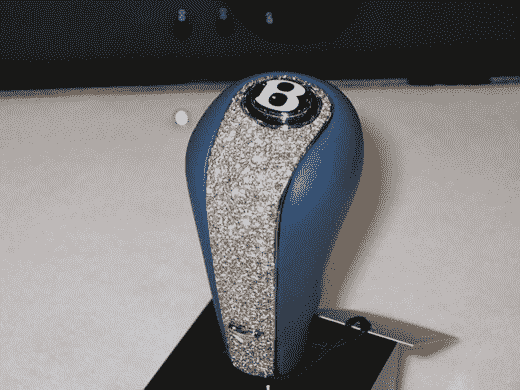

# 世界上最贵的换挡手柄| TechCrunch

> 原文：<https://web.archive.org/web/http://techcrunch.com/2007/03/13/worlds-most-expensive-shift-knob/>

有大把的钱和一辆宾利？你很幸运。显然，一个著名的公司，冰封 EMZ 提供了 150，000 美元的换档手柄，被吹捧为世界上最昂贵的换档手柄。它以 10 盎司 18k 白金和 30k 无瑕钻石为特色。哦，当然还有一个巨大的屁股上的宾利标志。如果你是个有钱的嘻哈明星，或者如果你需要……啊… *补偿*一些别的东西，就去买一个吧。

[官方网站](https://web.archive.org/web/20150626160712/http://www.icedoutemz.com/FeatureItem.html)【via[红鼬](https://web.archive.org/web/20150626160712/http://www.redferret.net/?p=8427)