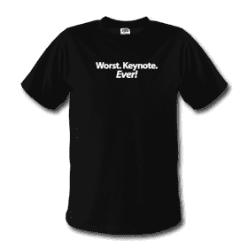

# “最糟糕。主题演讲。永远！”t 恤:接招吧，史蒂夫·乔布斯

> 原文：<https://web.archive.org/web/http://techcrunch.com:80/2007/06/12/worst-keynote-ever-t-shirt-take-that-steve-jobs/>

因为乔布斯的[主题演讲](https://web.archive.org/web/20150603024244/http://crunchgear.com/2007/06/11/apple-wwdc-2007-liveblog/)昨天搞砸了，这家伙要大捞一笔了。一件简单的黑色 t 恤，上面写着非常贴切的短语“最差”。主题演讲。*有史以来！*”潦草地划过前方。只要不到 20 美元，你就可以方便地向《WWDC 2007》中的[表达你对](https://web.archive.org/web/20150603024244/http://crunchgear.com/2007/06/11/post-wwdc-interview-with-matt-hickey-live/)的厌恶。

[产品页面](https://web.archive.org/web/20150603024244/http://www.spreadshirt.com/shop.php?op=article&article_id=2222180)【MacMerc.com】