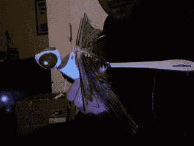

# 小蜻蜓动手了。判决:牛逼！TechCrunch

> 原文：<https://web.archive.org/web/http://techcrunch.com:80/2007/02/07/wowee-dragonfly-hands-on-verdict-awesome/>

一些背景:我尝试过组装和放飞一次航模，只有一次。我大约 11 岁，在一次尝试升空后，它坠毁了，再也不能飞了。

所以今天，当我在邮件中发现一个漂亮的新 Wowee Flytech 蜻蜓(一个据说很容易使用的蜻蜓形状的遥控飞行器)时，这是我多年来第一次尝试模型飞行。

我没有失望。这不会提高你的工作效率，但是这真的很有趣。

当你拿到蜻蜓的时候，你注意到的第一件事就是它的整体感觉是多么的轻和薄。身体基本上是虫子形状的聚苯乙烯泡沫塑料，翅膀是纸一样薄的塑料。然而，这种脆弱对于 A)实现飞行，以及 B)防止它在坠毁时造成太大的破坏几乎是必不可少的。

放入六节 AA 电池(是的，很多，所以拿出电池充电器)并把它们插在遥控器上(这和 Xbox 360 遥控器有惊人的相似之处)。蜻蜓本身通过插入遥控器充电，这非常方便(也非常适合旅行)。)一旦蜻蜓的眼睛停止闪烁，你就可以飞了。最棒的是:不需要组装！你所要做的就是把可拆卸天线插在遥控器上，它就完全准备好了。

我收回刚才的话，这是最精彩的部分:任何人都可以在一分钟内让这东西飞起来。简单地举起来，轻轻一扔，按下遥控器上的油门。接下来你知道的，你将会在你的客厅里驾驶蜻蜓。它非常容易使用。当你不可避免地把它撞到你的镜子和电视上时，它几乎肯定不会造成任何损害(再说一遍，这东西是非常轻质的泡沫。)我还没有机会长时间测试这个东西，所以不知道泡沫会持续多少次崩溃。

这是它的总体情况:

**优点:**

*   非常容易使用*   不需要装配*   不会造成太大的破坏*   带有额外的翅膀

**缺点:**

*   非常脆弱的感觉*   使用 6 节 AA 电池*   可能会吓到猫

蜻蜓将于春季上市，售价约为 50 美元，并将只在 Radio Shack 出售(至少一开始是这样)。)希望我很快会有一些视频。

更新:看看那东西上的 T3 视频，看看它看起来有多好玩:
 [https://web.archive.org/web/20151112042044if_/http://www.youtube.com/embed/pz0XNGJ-ep8?version=3&rel=1&fs=1&showsearch=0&showinfo=1&iv_load_policy=1&wmode=transparent](https://web.archive.org/web/20151112042044if_/http://www.youtube.com/embed/pz0XNGJ-ep8?version=3&rel=1&fs=1&showsearch=0&showinfo=1&iv_load_policy=1&wmode=transparent)

视频