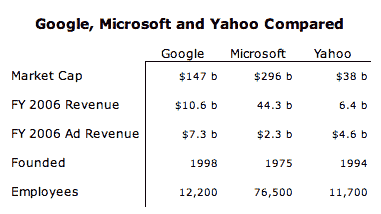

# 华尔街日报称微软/雅虎交易不会发生

> 原文：<https://web.archive.org/web/http://www.techcrunch.com:80/2007/05/04/wsj-says-microsoftyahoo-deal-not-happening/>

# 华尔街日报称微软/雅虎交易不会发生

在经历了[上午](https://web.archive.org/web/20220112001305/http://www.beta.techcrunch.com/2007/05/04/microsoft-pursues-yahoo-takeover/)围绕微软和雅虎 500 亿美元合并传闻的疯狂炒作和猜测之后，[华尔街日报现在说](https://web.archive.org/web/20220112001305/http://online.wsj.com/article/SB117827827757492168.html?mod=home_whats_news_us&apl=y)(今天关于这个话题的第五篇文章)交易不会发生，主要是因为雅虎不感兴趣。这篇文章还包含了三家公司的比较数据:

