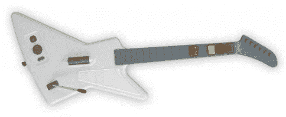

# X06:吉他英雄 2 即将登陆 Xbox 360——TechCrunch

> 原文：<https://web.archive.org/web/http://techcrunch.com/2006/09/27/x06-guitar-hero-2-coming-to-xbox-360/>

# X06:吉他英雄 2 即将登陆 Xbox 360

是啊！动视已经确认*吉他英雄 2* 将登陆 Xbox 360！自从我听到它将出现在其他主机上的传言以来，我一直在等人证实这一点。

这也不是唯一的好消息。该游戏还将采用专为 Xbox 360 设计的新控制器(模仿 Gibson Explorer)。不知道控制器是否会是无线的，但看起来它会是，因为它是为 360 制造的。也没有任何信息表明游戏是否会让我们在网上进行吉他对战。想想这些可能性:高清、在线、吉他大战。我等不及了！

[吉他英雄 2 即将登陆 Xbox 360](https://web.archive.org/web/20201129142010/http://www.xboxic.com/news/1705)【Xbox IC】