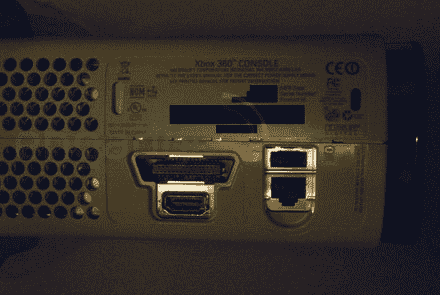

# Xbox 360 2.0(又名泽法)透露了一些

> 原文：<https://web.archive.org/web/http://techcrunch.com/2007/01/05/xbox-360-20-aka-zephyr-revealed-somewhat/>

# Xbox 360 2.0(又名泽法)透露了一些

这里有一张传闻中的 Xbox 360 下一版本背面的偷偷摸摸的照片，代号:泽法。最明显的增加是一个 HDMI 端口，用于真正/更容易的 1080p 输出。也有传言称，泽法将配备 120GB 的硬盘，以补充 Xbox Live 上所有可下载的内容和升级的 65 纳米 CPU。

我不知道这款车什么时候能上市，但它让我想暂缓购买 360。

[第二款 Xbox 360 揭晓:代号泽法](https://web.archive.org/web/20130628191703/http://www.engadget.com/2007/01/05/the-second-xbox-360-revealed-codename-zephyr/)【Engadget】