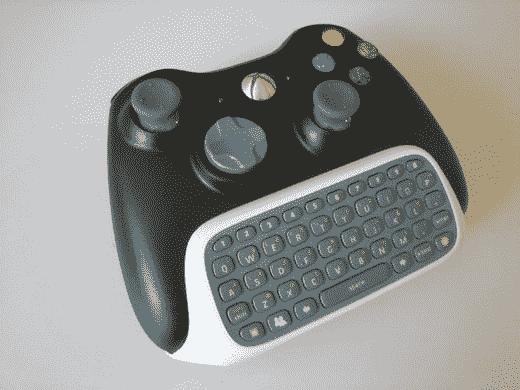
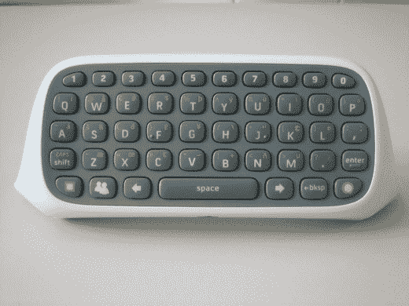

# Xbox 360 聊天板一点也不差(如果你用 MSN Messenger 的话)

> 原文：<https://web.archive.org/web/http://techcrunch.com/2007/07/23/xbox-360-chatpad-aint-bad-at-all-if-you-use-msn-messenger/>

我们[几天前发现](https://web.archive.org/web/20141003013928/http://crunchgear.com/2007/07/11/xbox-chatpad-outed-will-cost-30-available-sept-4/)微软的聊天板将于 9 月发布，售价 30 美元，但除此之外我们不知道太多。然而现在，由于 GameSpot 的一篇深入报道，我们知道得更多了。该网站称，聊天板的潜在市场仅限于那些使用 360 的 MSN Messenger 应用程序的人。在微软发布基于文本的杀手级应用(比如网络浏览器)之前，你可能不需要这个。但如果你这样做，请放心，它实际上是半路出家。

Chatpad 插在 360 控制器的底部，对于任何使用过全 QWERTY 手机的人来说，应该会感觉很舒服，比如使用过 CrunchGear 最喜欢的 [Helio Ocean](https://web.archive.org/web/20141003013928/http://crunchgear.com/2007/05/21/crazy-video-homes-fat-joe-reviews-the-helio-ocean/) 。GameSpot 指出，单个按钮提供了足够的触觉反馈，无论这意味着什么。pad 也是背光的，让你在晚上给你的在线笔友打字更容易忍受。所以垫本身就很好。

聊天板还包括一个新的有线耳机。嗯，“新”是一个强烈的词在这里使用，因为它和它的前身之间的唯一区别是不同的静音和音量控制按钮的位置。

总之，聊天板看起来很不错。但同样，除非你在 360 上输入大量文本，否则没有理由选择这个。

[Xbox 360 信使套装上手](https://web.archive.org/web/20141003013928/http://www.gamespot.com/features/6175451/index.html)【GameSpot】