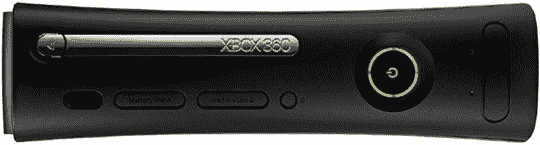

# Xbox 360 Elite 将于 10 月登陆日本

> 原文：<https://web.archive.org/web/http://techcrunch.com:80/2007/07/05/xbox-360-elite-hitting-japan-in-october/>

我应该在 10 月份访问日本，所以如果有某种带有 HDMI 连接的 360 的反常热潮，我会在那里捕捉这一时刻。微软今天宣布，它将正式把黑色，昂贵的 Xbox 360 精英带到日本。到了 10 月 11 日，日本人将可以走过不止两个，而是三个版本的 Xbox 360，希望得到一台[任天堂 Wii](https://web.archive.org/web/20170708015149/http://www.crunchgear.com/?s=nintendo) 。

如果你真的想买一台，你需要支付 47800 日元，约合 390 美元——比美国版便宜近 100 美元。

[微软将于 10 月在日本推出 Xbox 360 Elite](https://web.archive.org/web/20170708015149/http://www.reuters.com/article/technology-media-telco-SP/idUSTFA00279820070705)【路透社】