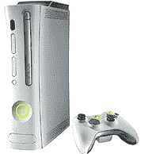

# Xbox 360 价格逐年下降

> 原文：<https://web.archive.org/web/http://techcrunch.com:80/2006/09/07/xbox-360-price-to-decrease-annually/>

# Xbox 360 价格将逐年下降

看起来 Xbox 360 的价格会逐年下降。微软 Xbox 产品组副总裁托德·霍尔姆达尔(Todd Holmdahl)向路透社提到了降价一事。这很有意义，因为世界开始看到 PS3 的价格，他们会被提醒 360 越来越便宜了。见鬼，它出来的时候会比索尼的机器便宜一半。

> 公司副总裁霍尔姆达尔说，360 将逐年减少，因为价格战甚至在推出之前就开始了
> 
> 在推出 Xbox 上损失了近 40 亿美元后，微软的目标是在两年内通过 Xbox 360 实现收支平衡。在另一项积极的举措中，该公司表示将致力于每年降低新机器的价格。
> 
> Xbox 产品集团公司副总裁托德·霍尔姆达尔(Todd Holmdahl)在接受路透社采访时表示:“我们将每年降低产品成本，”鉴于使用授权技术而不是购买现成的组件，微软应该很容易做到这一点。

编辑:可惜价格居高不下。上周我试图购买一台，失望地发现 pro 系统仍然是 399 美元。希望这些价格会很快下降，

[Xbox 360 价格逐年下降【Xbox365.com ](https://web.archive.org/web/20201124150655/http://www.xbox365.com/news.cgi?id=GGuiGNiLiN09191226)