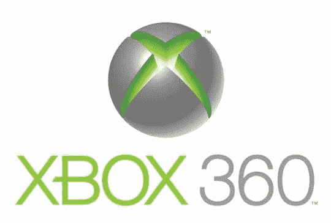

# Xbox 360 价格将在 8 月 8 日下降 50 美元？

> 原文：<https://web.archive.org/web/http://techcrunch.com/2007/07/25/xbox-360-prices-to-drop-50-on-august-8th/>

战争。如果你是消费者，并且你指的是价格战，这绝对是件好事。我指的是价格战。

据传，在索尼 PS3 降价 100 美元后不久，微软将于 8 月 8 日开始下调 Xbox 360 的价格。

目前还不知道降价是否会影响所有三个 Xbox 360 版本，尽管包括 *Madden NFL '08* 和 *Bioshock* 在内的一系列新游戏将在不到一周之后上市，可能会将骑墙派牢牢推入微软的领地。

任天堂是否会降低 Wii 的价格仍然没有消息。它仍在努力保持单位库存。一小步一小步。

[Xbox 规格:8 月降价 50 美元](https://web.archive.org/web/20150712113205/http://www.hollywoodreporter.com/hr/content_display/news/e3i75ec4629cfe1313a51e0e767c0ee6860)【好莱坞报道】