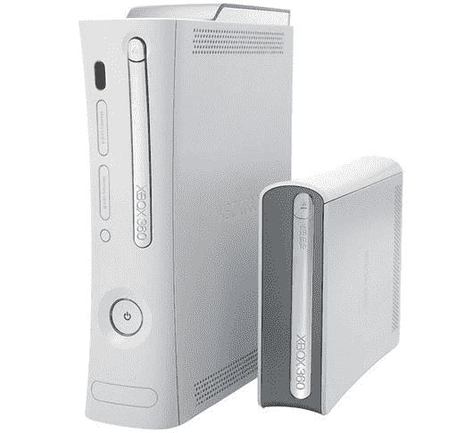

# Xbox 360 升级版将于 2007 年推出

> 原文：<https://web.archive.org/web/http://techcrunch.com/2006/09/27/xbox-360-uprade-coming-in-2007/>

# Xbox 360 升级版将于 2007 年推出

新加坡特许半导体公司宣布，他们正在为 Xbox 360 生产升级的 CPU，使用 65 纳米而不是 90 纳米。新的 CPU 不会提高性能，但它会(希望)阻止 Xbox 360 过热。新 CPU 的制造成本也更低，这也为 360 的价格下降打开了一点空间，这取决于新 CPU 的制造成本实际上有多低。

这会阻止我下周买 Xbox 360 吗？可能不会，但如果你在等待过热问题消失，价格下降，这可能不会太远。

Xbox 360 升级