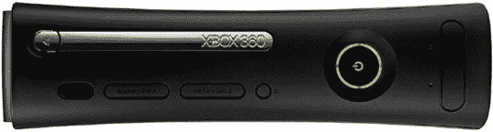

# Xbox 360 获得故障延长保修| TechCrunch

> 原文：<https://web.archive.org/web/http://techcrunch.com/2007/07/05/xbox-360s-get-extended-warranty-for-failures/>

今天早些时候，我们提到了关于 [Xbox 360 的故障率](https://web.archive.org/web/20140904020536/http://crunchgear.com/2007/07/05/console-failure-rates-sony-and-nintendo-for-the-win/)似乎比其他所有游戏机都要高。你瞧，微软公司通过将全球 Xbox 360 保修范围扩大到自购买之日起 3 年的一般硬件故障来回应。这显然是由三个闪烁的红灯指示的。该公司还追溯报销人们的维修费用，这很酷。

然而，让我感到害怕的是他们在公告中使用的一句话:

> 在确定了一些可能导致控制台上三个红色闪烁灯指示的一般硬件故障的因素后，微软对控制台进行了改进，并为现有和新客户增强了 Xbox 360 保修政策。

“若干因素？”我的意思是，我知道有些东西会出错——毕竟这是一台计算机——但看起来他们现在应该把这个“数字”减少到“几个”,不是吗？

[阅读致 Xbox 社区的公开信](https://web.archive.org/web/20140904020536/http://www.xbox.com/en-US/support/petermooreletter.htm)。