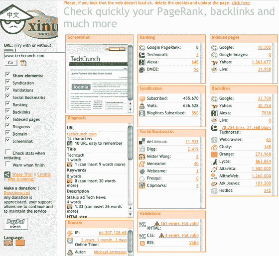

# Xinu:任何网站的更多统计数据 TechCrunch

> 原文：<https://web.archive.org/web/http://www.techcrunch.com:80/2007/07/14/xinu-comprehensive-page/>

# Xinu:任何站点的更多统计数据

Xinu 是一项提供页面统计和数据综合概述的服务，这使得像 [Popuri](https://web.archive.org/web/20221007002314/http://www.beta.techcrunch.com/2007/03/26/lots-of-stats-for-any-site/) 这样千篇一律的网站不复存在。

Xinu 不是你在这个领域使用的最漂亮的服务，但它是最重要的数据。通常的统计数据包括在内，如 Technorati 链接，谷歌和雅虎的细节等。然而，Xinu 提供了更多的统计数据，来自一系列社会化书签网站(一些我从未听说过的网站)、页面分析、页面验证等等。

我不太了解这个网站的背景，也不知道我们是否会因为提及它而扼杀它(例如，它没有自己的域名)，但如果它一直存在，那么如果你在跟踪网站统计数据，它是非常值得一看的。

