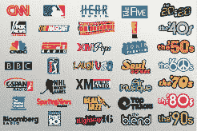

# XM 和 Sirius 将提供廉价的单点产品| TechCrunch

> 原文：<https://web.archive.org/web/http://techcrunch.com/2007/07/23/xm-and-sirius-to-offer-cheap-al-a-carte-offerings/>

这里没有太多的信息，但很明显，如果 XM-Sirius 合并真的通过，你将能够以低廉的价格打开你的卫星广播。两家公司都计划提供一个 6.99 美元的低成本套餐，可以接收 50 个频道，以及一个 16.99 美元的交易，可以提供两个世界的最佳服务。您还可以添加和删除您认为合适的频道。听起来像是消费者的胜利！已经批准合并了，联邦通信委员会！

[XM，Sirius 提供低成本，按菜单点菜的选择](https://web.archive.org/web/20150512185143/http://today.reuters.com/news/articlenews.aspx?type=technologyNews&storyid=2007-07-23T150715Z_01_WNAS7008_RTRUKOC_0_US-XM-SIRIUS.xml)[路透社]