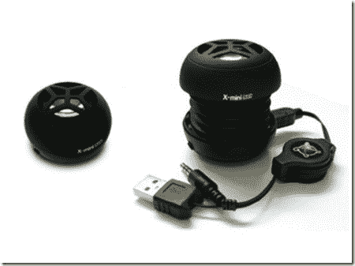

# XM-I 宣布推出手风琴式迷你 USB 扬声器

> 原文：<https://web.archive.org/web/http://techcrunch.com:80/2007/08/06/xm-i-announces-accordion-like-mini-usb-speakers/>

# XM-I 宣布推出手风琴式迷你 USB 扬声器

XM-I 发布了完美的扬声器，适合经常出差的人或任何人，真的，想要强大的扬声器，便于携带。USB 供电的扬声器具有一个真空室，当伸出时，会产生类似低音炮的轰隆声。有一个内置的可充电电池，带有可伸缩的双接口 USB 电缆和立体声迷你插孔连接器。开/关开关还兼作音量控制。X-mini 胶囊扬声器目前在新加坡售价 32 美元，据说红色版本即将推出。

[X-mini 胶囊音箱](https://web.archive.org/web/20130628184559/http://asia.cnet.com/reviews/gadgetbuzz/0,39041749,62030213,00.htm)【CNet 亚洲】