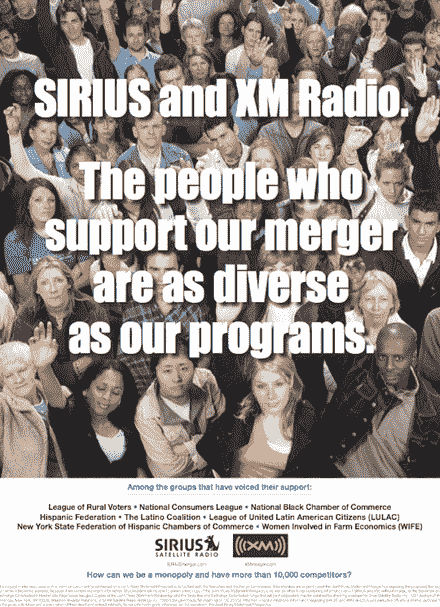

# XM，Sirius 引用“多样性”来推动拟议的合并

> 原文：<https://web.archive.org/web/http://techcrunch.com/2007/06/13/xm-sirius-cite-diversity-to-promote-the-proposed-merger/>

XM 和 Sirius 正试图合并(或者你没听说过吗？)但在政府和媒体方面都遇到了很多阻力，更不用说大批愤怒的普通消费者了，他们也反对这种做法。因此，这些公司购买了一个广告来展示他们的支持是多么的“多样化”。去看它…

八个组织以他们的名义支持这项事业，其中一半是西班牙裔团体。那就是多样化？但我最喜欢的广告部分是最后一句话:我们怎么可能是垄断企业，有一万多个竞争对手？

不能和四年级的逻辑争论，不，先生。这 10，000 个竞争者是什么？我能想到几个，比如 iPod 和网络收音机，但还剩下 9998 个。

但是就像我们尊敬的乔什·戈德曼说的，只要他们不收我更多的钱或者让我换收音机，我不在乎他们是否合并。如果我是顾客，我想。

[多元化广告](https://web.archive.org/web/20140908220303/http://tctechcrunch2011.files.wordpress.com/2007/06/diversityad.pdf)(PDF)[XMmerger.com]