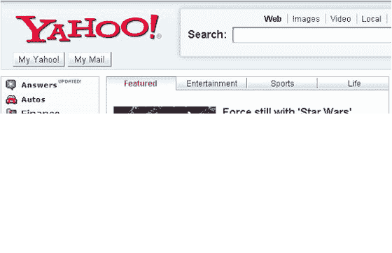

# 雅虎在主页上试验非雅虎链接

> 原文：<https://web.archive.org/web/http://www.techcrunch.com:80/2007/05/26/yahoo-experiments-with-third-party-links-on-home-page/>

# 雅虎在主页上试验非雅虎链接

主要的互联网门户网站，如雅虎、美国在线、MSN、谷歌等。不要把链接放在他们的主页上，除非链接到更深的地方。广告通常是唯一的例外。

所以当雅虎本周早些时候联系我们说他们正在测试来自他们主页的外部链接时，我们感到很惊讶。他们说，目标是让 Yahoo.com 尽可能地与他们的利益相关。通过链接到外部网站，他们希望雅虎门户的相关性(感知的或实际的)会增加。

来自 CrunchGear 的一篇[文章](https://web.archive.org/web/20220808125058/http://crunchgear.com/2007/05/24/george-lucas-caves-will-let-star-wars-fans-edit-clips-of-his-great-movies/)被包含在测试中，昨天在雅虎主页上放了一个小时左右。其他网站也被链接到。这些链接被放在“特色”部分的顶部中心位置。

雅虎表示，他们将分析测试的数据和反馈，以确定他们是否会将此作为一项永久政策。我的要求是他们继续测试，并随时使用我们的属性。

