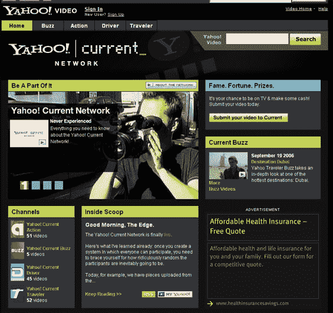

# 雅虎！推出更好的视频内容 TechCrunch

> 原文：<https://web.archive.org/web/http://www.techcrunch.com:80/2006/09/19/yahoo-launches-better-video-content/>

# 雅虎！推出更好的视频内容

在股票遭受重创的一天，雅虎！与[时事电视台](https://web.archive.org/web/20221001030524/http://www.current.tv/)联手推出[雅虎！Current Network](https://web.archive.org/web/20221001030524/http://video.yahoo.com/currenttv) ，一个混合了专业和用户提交视频的视频网站。Current TV 是一个由环保主义者阿尔·戈尔支持的有线和卫星频道，播放用户提交的短片和片段，称之为“观众创造的内容”。雅虎！获得了其视频门户网站独家当前电视内容的权利，作为回报，雅虎获得了一些最佳用户提交的内容。可能会进入地面电视频道。

Current TV 之前与谷歌达成了一项鲜为人知的协议，发布了谷歌 Current T10，这是一个类似的概念，尽管它是在 Current TV 网站和服务器上托管的(他们从与搜索巨头的关系中得到了什么还不清楚，除了在视频中大肆宣传公司的名字)。回到雅虎！现在有四个频道的当前内容(这些名字很快就会变得混乱)-雅虎！当前操作，雅虎！当前的嗡嗡声，雅虎！当前驱动程序和 Yahoo！当前旅行者。我们将把这些通道的描述留给读者作为练习。有些内容实际上相当不错，比你在 YouTube 或其他业余信息交换所找到的要好得多。作为一个例子，[这个视频给你的](https://web.archive.org/web/20221001030524/http://video.yahoo.com/video/play?vid=c860df3ccf66c83fb61bb2ffd934330b.863635)不仅是一个体面的介绍什么雅虎！current 是关于，但是是 Bono 的一个短片和 U2 的“The Edge”。如果你是 U2 的粉丝，你可能会欣赏 Bono 走进 Edge 的房间并在早上叫醒他的片段(未发布的导演剪辑了 Bono 跟着他进浴室)并发现瑜伽实际上是威尔士的产品。

随着 YouTube 的流行和其他公司推出类似的视频服务，这是雅虎的一个很好的努力。以提高视频帖子的质量，并吸引更多的观众。雅虎！视频实际上是一种很好的服务，视频质量很好，而且有很多可靠的功能。雅虎！现在有一些好的视频内容给它的服务带来一点推动，但这是一个竞争激烈的领域，所以期待在未来几个月里来自每个人的更专业的视频内容。

