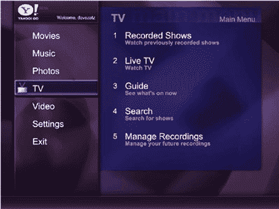
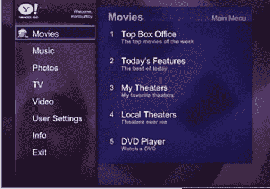

# 雅虎推出 DVR 服务:Yahoo Go TechCrunch

> 原文：<https://web.archive.org/web/http://www.techcrunch.com:80/2006/04/25/yahoo-launches-dvr-service-yahoo-go/>

# 雅虎推出 DVR 服务:Yahoo Go

  雅虎今日推出 [Yahoo Go](https://web.archive.org/web/20221003221246/http://go.connect.yahoo.com/go/tv/get_started) ，一款 DVR 和通用微软媒体中心的竞争对手基于[最近收购的](https://web.archive.org/web/20221003221246/http://www.meedio.com/index.html) Meedio 技术。

[功能列表](https://web.archive.org/web/20221003221246/http://go.connect.yahoo.com/go/tv/features)全面:使用 Yahoo Go 管理照片，搜索雅虎视频，观看硬盘上存储的电影，听音乐，并通过完整的 DVR(如 Tivo 或微软媒体中心)管理电视节目。Yahoo Go 仅适用于 Windows 机器。

雅虎 Go 将很难与微软的媒体中心竞争，原因很简单，它不会像媒体中心那样内置于数百万台个人电脑中。但至少他们现在在游戏中。更多来自 GigaOm 和 Dave Zatz 的报道。

下面的屏幕截图。

