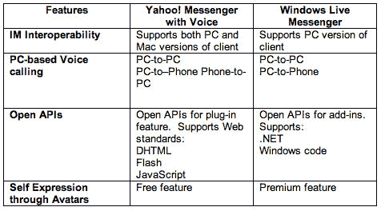

# 雅虎推出带有 180 个插件的 Messenger 8——TechCrunch

> 原文：<https://web.archive.org/web/http://www.techcrunch.com:80/2006/07/28/yahoo-launches-messenger-8-with-180-plugins/>

# 雅虎推出带有 180 个插件的 Messenger 8

  [雅虎信使第 8 版【Windows 版，可以在这里](https://web.archive.org/web/20210918143927/http://www.beta.techcrunch.com/2006/06/19/yahoo-opens-im-to-developers/)下载[，今天推出测试版。我们之前关于测试版发布的报道是](https://web.archive.org/web/20210918143927/http://messenger.yahoo.com/)[这里是](https://web.archive.org/web/20210918143927/http://www.beta.techcrunch.com/2006/06/19/yahoo-opens-im-to-developers/)。

Messenger 8 的关键新特性是，它对第三方开发者开放，允许他们创建在客户端工作的小部件。据雅虎报道，自平台开放以来，上个月已经创建了 180 个插件。

五个最流行的插件是:

*   Pando:与朋友共享大文件(甚至是文件夹)的简单、快速和可靠的方式，一次可达 1 GB。
    自 2006 年 6 月 20 日以来已有 31，757 次下载
*   快捷方便地访问所有秘密和隐藏的表情符号。单击动画笑脸将自动插入到文本中。
    自 2006 年 7 月 11 日以来已有 29，201 次下载
*   雅虎！问候电子贺卡:浏览精选的电子贺卡，在聊天时发送给朋友。
    自 2006 年 6 月 20 日以来已有 13，358 次下载
*   iTunes:适用于雅虎的 iTunes remote！信使。注:您需要安装 iTunes 才能使用此插件。
    自 2006 年 7 月 18 日以来已有 13，125 次下载
*   Eazibo:与您的朋友在线互动，即时制作流程图或图表，分享照片和做注释的最佳方式。这叫做“即时图形”
    自 2006 年 7 月 18 日以来已有 11，900 次下载

Yahoo Messenger 是仅次于 MSN 的第二大即时通讯网络，尽管 Yahoo 和 MSN 已经宣布了互操作性(并继续扩大测试组进行测试)，但两个团队之间仍然存在一定程度的竞争。雅虎发给我下图，比较了这两种服务。

