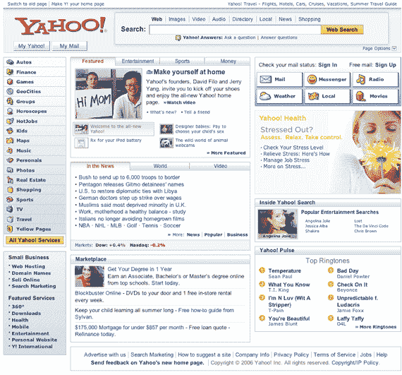
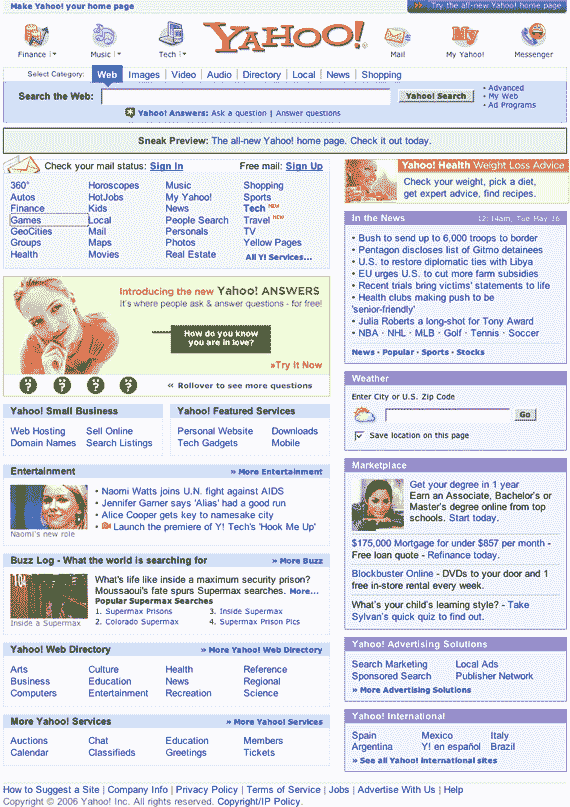

# 雅虎推出新主页

> 原文：<https://web.archive.org/web/http://www.techcrunch.com:80/2006/05/16/yahoo-launches-new-home-page/>

# 雅虎推出新主页

[新的雅虎主页](https://web.archive.org/web/20220521055143/http://www.yahoo.com/preview)，之前在[yahoo.com/preview](https://web.archive.org/web/20220521055143/http://www.yahoo.com/preview)的[私下测试](https://web.archive.org/web/20220521055143/http://www.beta.techcrunch.com/2006/04/18/yahoo-testing-new-home-page-layout/)，现在任何使用 IE 或火狐(1.5 版本以上)的人都可以使用。有许多修饰性的变化，包括更宽的页面布局，更大的搜索栏，以及智能地使用 Ajax 使页面更具交互性(例如，将鼠标放在右边栏的“mail”上)。更多关于雅虎搜索博客的信息。

关键的变化包括一个“个人助理”，这是一个预览区，可以看到最近的电子邮件，雅虎 IM 的在线朋友列表和其他信息(交通，天气等)。).他们还推出了雅虎脉动！“这是我们约 5 亿用户关注流的一个窗口”。

Richard MacManus 与雅虎首席产品官 Ash Patel 和前门副总裁 Tapan Bha 就发布会进行了播客。

新旧雅虎页面的屏幕截图:

**新增:**

**旧:**

