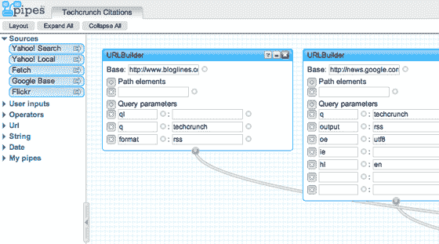

# 雅虎！推出管道 

> 原文：<https://web.archive.org/web/http://www.techcrunch.com/2007/02/07/yahoo-launches-pipes/>

当消费者的直接利益可能不那么明显时，解释一个新产品的重要性是需要努力的，还有雅虎笨拙地命名为[“pipes”。](https://web.archive.org/web/20230219130815/http://pipes.yahoo.com/)也不例外。产品名称取自 UNIX 世界，其中管道是应用程序之间传输数据的管道，而 Yahoo 产品则是 web 服务之间传输数据的管道。基本形式是雅虎！Pipes 允许您从一个或多个来源获取数据，并将其整合到一起，例如，聚合一组提要。

但是雅虎！Pipes 超越了 pipes 本身和 pipes 所做的事情，因为应用程序提供了将执行各种不同操作的功能(或在应用程序模块中调用的功能)。有可用于提示用户输入的模块(各种输入类型)，不同的运算符来计数、循环、剪切、计数、排序和合并数据，以及各种字符串和日期函数。因为已经有了广泛的可用功能，Yahoo！Pipes 更类似于 web 的 shell 脚本环境，而不仅仅是应用程序之间的简单管道。它的工作方式就像一种可视化的过程化编程语言，过程的输出以文本输出、RSS、甚至是 JSON 的短信提醒的形式出现在底部。您可以使用提要、用户输入或其他管道作为输入。

该应用程序的优点在于其简单性——用户可以获取任何来源、用户输入请求或上述模块，并将它们拖放到位，然后连接管道。几分钟之内，我就构建了一个应用程序(也称为管道，他们可能应该改一下名字，因为不是所有东西都可以是管道)，它可以在各种提要中搜索“Techcrunch ”,将数据汇集在一起，对其进行排序，并过滤出唯一的结果。我保存了应用程序[并发布了它](https://web.archive.org/web/20230219130815/http://pipes.yahoo.com/pipes/vp9zXTy32xGiewBxZFUMqA/)，从那里我现在可以随时执行它并接收各种格式的输出。我可以复制一个现有的管道(application，argggh ),并将其用作我自己管道的基础模板，我还可以浏览现有的管道库。

管道可以将任何 feed 作为输入，结合已经可用的函数列表，证明是非常强大的——我的大脑仍然在嗡嗡作响，想着可以用管道做什么。我认为一些术语需要澄清，需要在主页上有一个更好的介绍，但除此之外，这个产品太棒了。这是不可避免的，这样的产品将被释放，这是非常好的雅虎！他们设法成为第一个发布这种产品的大型网络公司。他们将 Google Base 作为默认资源包含在 Pipes 中的事实表明，web 比桌面更注重互操作性。

详见[安尼尔·达什](https://web.archive.org/web/20230219130815/http://www.dashes.com/anil/2007/02/08/yahoo_pipes)、[蒂姆·奥赖利](https://web.archive.org/web/20230219130815/http://radar.oreilly.com/archives/2007/02/pipes_and_filte.html)和[杰瑞米·扎沃德尼](https://web.archive.org/web/20230219130815/http://jeremy.zawodny.com/blog/archives/008513.html)。

