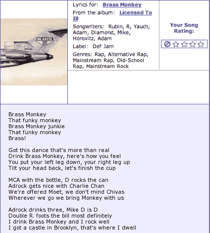

# 雅虎音乐将在今天晚些时候添加歌词

> 原文：<https://web.archive.org/web/http://www.techcrunch.com/2007/04/24/yahoo-music-to-add-music-lyrics-later-today/>

# 雅虎音乐将在今天晚些时候添加音乐歌词

今天晚些时候，雅虎音乐将为成千上万首歌曲添加歌词，这是它们首次合法出现在互联网上。它们是通过与 [Gracenote](https://web.archive.org/web/20211027003203/http://www.gracenote.com/) 的合作提供的，Gracenote【】因其检测和阻止网站上有版权的歌曲的技术而闻名[。一段时间以来，该公司一直在与唱片公司合作，整合歌词版权。](https://web.archive.org/web/20211027003203/http://www.beta.techcrunch.com/2006/10/29/myspace-moves-to-protect-copyright-holders/)

雅虎音乐的雅虎产品开发副总裁伊恩·罗杰斯([见我们的采访](https://web.archive.org/web/20211027003203/http://www.talkcrunch.com/2007/01/10/talk-with-yahoo-music-execs-on-the-fate-of-drm/))说今天下午会在雅虎音乐博客[上发布一个帖子，详细介绍。
 ***更新:**罗杰斯已经*](https://web.archive.org/web/20211027003203/http://ymusicblog.com/)*[在雅虎音乐博客上发布了](https://web.archive.org/web/20211027003203/http://ymusicblog.com/blog/2007/04/24/lyrics-by-the-pound/)，歌词现已直播。见[music.yahoo.com/lyrics](https://web.archive.org/web/20211027003203/http://music.yahoo.com/lyrics)。歌词免费提供给雅虎，以换取网站广告的收入分成。*

这是我第一次在雅虎上看到“混蛋”这个词。:-)