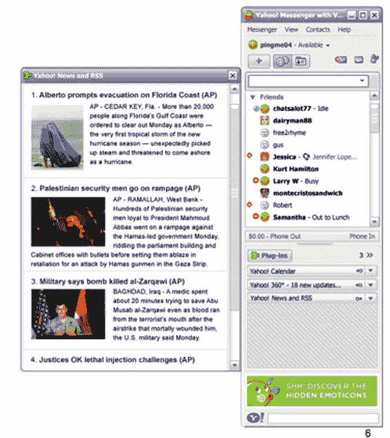

# 雅虎向开发者开放即时通讯

> 原文：<https://web.archive.org/web/http://www.techcrunch.com:80/2006/06/19/yahoo-opens-im-to-developers/>

# 雅虎向开发者开放即时通讯

  拥有 6000 万全球用户的雅虎信使，刚刚变得有趣多了。今天太平洋标准时间下午 6 点，雅虎发布了用于 Windows 个人电脑的雅虎信使 8.0(T4)，并发布了一个软件开发工具包，允许第三方创建内容插件，用户可以添加到他们的雅虎即时消息中。插件可以使用 javascript、flash 或两者来构建。

有两类插件。**对话插件**与聊天环境本身互动。例如，使用 event finder 插件，两个聊天的人可以调出雅虎地图，找到相关的餐馆、地点等。来讨论它们。我看到演示的另一个插件是“头像空间”，用户可以在虚拟环境中使用头像进行互动，拉进 flickr 照片和其他道具等。另一种类型的插件**个人插件**，将内容直接拉入 IM 客户端本身。用户可以添加新闻、雅虎 360、日历插件等。这个想法是将核心 web 服务拉入 IM 客户端，避免打开浏览器的需要。

下午 6 点后可以在 developer.yahoo.com/messenger[访问 SDK。完成的插件在](https://web.archive.org/web/20220818224609/http://developer.yahoo.com/messenger)[gallery.yahoo.com/messenger](https://web.archive.org/web/20220818224609/http://gallery.yahoo.com/messenger)展示。

