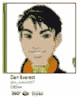
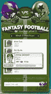

# 看看雅虎的 Vista 信使——TechCrunch

> 原文：<https://web.archive.org/web/http://www.techcrunch.com:80/2007/01/07/yahoo-peels-the-curtain-on-ces/>

# 看看雅虎的 Vista 信使

上周晚些时候，我与雅虎的 Matthew Skyrm 和 Joshua Jacobson 通了电话，讨论将在 CES 上发布的新 Vista 优化版雅虎信使的演示。总的来说，从设计和用户界面的角度来看，我们对该产品印象深刻，尽管没有值得注意的功能增加。

新的 messenger 利用了 Vista 新的[Windows Presentation Foundation](https://web.archive.org/web/20220816072411/http://en.wikipedia.org/wiki/Windows_Presentation_Foundation)(WPF)应用程序开发框架，该框架通过允许设计师使用 [XAML](https://web.archive.org/web/20220816072411/http://en.wikipedia.org/wiki/Extensible_Application_Markup_Language) 标记用户界面，进一步分离了工程和设计团队。作为一个额外的优势，它是基于矢量的，所以当显示器变得更好时，漂亮的图片会保持漂亮。

雅虎！通过一些新的用户定制展示了这种新的灵活性。一些小的调整包括将聊天功能整合到标签中，在 Vista 的小工具托盘上为 YM 标记一个位置，以及自动添加你在雅虎上结交的朋友群网络给你信使。

用户界面最大的变化之一是用户可以放大和缩小好友列表，显示用户详细信息，最终显示他们的雅虎账户活跃度(360！，Flickr)，进入焦点。您还可以缩小到基本视图，并以网格格式显示。

 一个弹出的托盘现在可以很容易地在应用程序的颜色和纹理之间切换。雅虎！美国对 WPF 的使用也使得他们为基于雅虎的团体开发定制皮肤变得容易。服务。第一个例子是他们广受欢迎的梦幻足球服务，在那里你可以跟踪和谈论你即将到来的比赛。足球头盔随着每场比赛而变化。最后，YM 在聊天窗口中内置了照片共享功能，允许你一边浏览照片幻灯片，一边聊天。

想要更好的照片和视频预览，请访问雅虎！s [产品页面](https://web.archive.org/web/20220816072411/http://messenger.yahoo.com/windowsvista.php)。

这种对开发者可以利用 WPF 的设计和行为分离做些什么的早期观察，跟随我们在网络上看到的趋势，让我对未来的应用程序抱有很高的期望，应该会让许多开发者的生活变得更容易。

