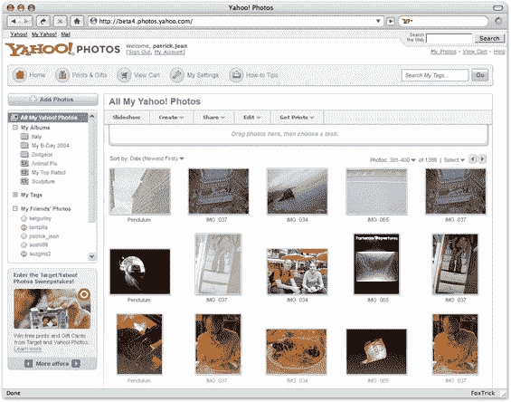
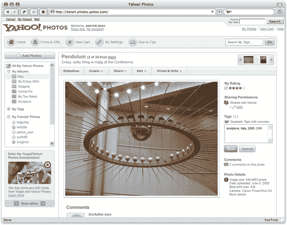
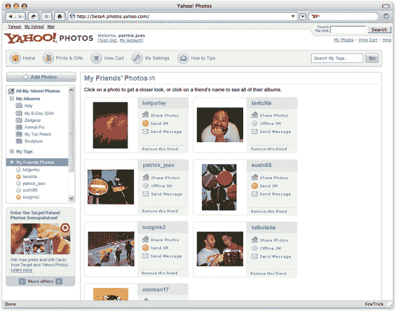

# 雅虎照片测试版今日发布 

> 原文：<https://web.archive.org/web/http://www.techcrunch.com:80/2006/06/07/yahoo-photos-beta-launches-today/>

[万众期待](https://web.archive.org/web/20230122183951/http://techcrunch.com/2006/02/08/yahoo-photos-overview-exclusive-screenshots/)新[雅虎照片](https://web.archive.org/web/20230122183951/http://photos.yahoo.com/)测试版将于太平洋时间周四上午 9 点左右推出。

在[photos.yahoo.com](https://web.archive.org/web/20230122183951/http://photos.yahoo.com/)用你的雅虎 ID 登录。如果你在右上角看到一个“试用新测试版”的图片/链接，那么它是实时的。点击链接请求邀请——雅虎计划在接下来的一周让大约 10，000 人加入，并将从那里开始增加。

我在今年早些时候的演示会上看到了新的雅虎照片产品的演示(见这里的[截图](https://web.archive.org/web/20230122183951/http://techcrunch.com/2006/02/08/yahoo-photos-overview-exclusive-screenshots/)——更多见下文)，今晚在发布会上又看到了一次。团队成员达里尔·伊顿(Darryl Eaton)、威尔·奥尔德里奇(Will Aldrich)、斯科特·席勒(Scott Schiller)、蒂姆·安德森(Tim Anderson)和帕特里克·简都在那里，还有 Flickr 的联合创始人斯图尔特·巴特菲尔德和其他人。

新功能带来了 Flickr 的精华(大量 Ajax、标签和集合等功能，以及拖放照片的能力)以及 Flickr 没有的新东西。无限制的免费上传和带宽，全质量上传(和下载)，点击标签编辑。两个额外的功能——在一个页面上显示大量图片(见截屏),以及一个叫做“智能相册”的东西。智能相册允许根据规则(评分、标签、日期等)动态创建相册。)，还允许包含朋友的照片。使用智能相册，用户可以创建像“高度评价”或“新”的相册，这些相册将总是动态创建的。

我和团队讨论了视频什么时候可以和照片一起上传。没有公开或不公开的声明或暗示，但一些事情告诉我他们可能会在这方面努力。

Yahoo Photos 是最大的在线照片网站，每月有近 3100 万独立访客(相比之下，Flickr 只有 1650 万)。Flickr 是为早期用户准备的。雅虎照片过去是面向大众的，但一些早期用户可能也会尝试一下。

