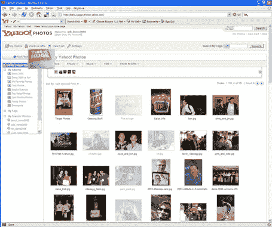
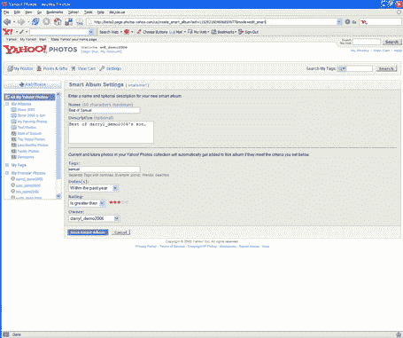
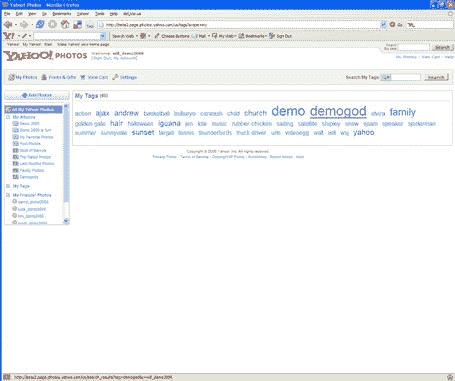
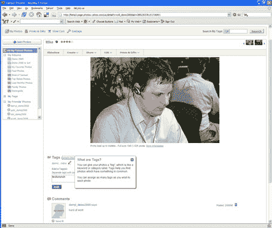
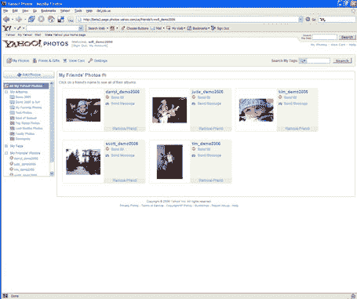

# 雅虎照片概览，独家截图

> 原文：<https://web.archive.org/web/http://www.techcrunch.com:80/2006/02/08/yahoo-photos-overview-exclusive-screenshots/>

  将新的[雅虎照片](https://web.archive.org/web/20220627083548/http://photos.yahoo.com/)与所有在演示会上展示其产品的[早期公司进行比较是不完全公平的。但这是一个非常令人印象深刻的产品，他们来这里展示它是件好事。新的雅虎照片将于今年春天推出。](https://web.archive.org/web/20220627083548/http://www.beta.techcrunch.com/2006/02/07/a-taste-of-demo-2006/)

每个人都知道雅虎拥有 Flickr，这是他们在 2004 年末购买的广受欢迎的照片标记和分享服务。但大多数人不知道(我不知道)的是，每月大约有 3000 万独立访客访问雅虎照片(雅虎照片服务)和 Flickr 上的大约 800 万。 Flickr 有 mind share 雅虎照片带来了真正的(独特的)流量。

全新的雅虎照片将于三月发布。它结合了许多 Flickr 最受欢迎的特性(比如标签和设置)和一些全新的东西，非常引人注目。新服务的独家截图如下。

雅虎照片将完全免费，并允许上传和存档无限数量的原始高分辨率图片。收入将来自网站上的广告，以及高级印刷和其他服务(书籍、日历、印刷品等)。).像 Flickr 一样，雅虎也将允许用户在当地的目标商店购买印刷品。

## 特征

雅虎照片将整合流行的 Flickr 功能，如标签和设置，以及上面提到的流行的打印选项。下面的屏幕截图展示了其中的一些功能。

他们也在做新的东西。他们有两种类型的“集”，或专辑。标准集的工作方式非常像 Flickr。但是“智能相册”允许根据规则(评分、标签、日期等)动态创建相册。)，还允许包含朋友的照片。使用智能相册，用户可以创建像“高度评价”或“新”的相册，这些相册将总是动态创建的。

所有照片视图比 Flickr 好得多。一次可以查看更多的照片，Ajax 界面允许大量拖放到屏幕顶部的托盘中，以包含在相册中，共享(通过电子邮件和即时消息)等。

他们还没有整合照片和相册的 RSS 源，但这一天即将到来。

雅虎照片团队包括 Darryl Eaton、Will Aldrich 和 Scott Schiller，他们都参加了本周的演示。

屏幕截图:

