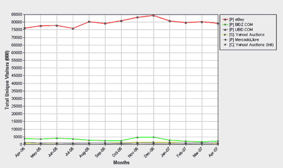

# 雅虎关闭拍卖-本月第二次向 DeadPool 提供服务 TechCrunch

> 原文：<https://web.archive.org/web/http://www.techcrunch.com:80/2007/05/09/yahoo-shutting-down-auctions-second-service-to-deadpool-this-month/>

# 雅虎关闭拍卖——本月第二次服务死亡池

  路透社[报道](https://web.archive.org/web/20220927221119/http://money.cnn.com/2007/05/09/technology/yahoo.reut//)[雅虎拍卖](https://web.archive.org/web/20220927221119/http://auctions.yahoo.com/)将于 6 月 16 日在美国和加拿大关闭，6 月 3 日之后将不再接受新的拍卖。香港、新加坡和台湾的拍卖网站将继续运营。

这是雅虎本月宣布的第二次服务关闭——上周有消息证实雅虎照片也将关闭。

就雅虎照片而言，用户将被导向雅虎旗下的 Flickr 以及其他第三方服务。关闭消除了产品冲突，有助于集中公司。Auctions 因另一个原因而关闭——它无法吸引易贝和其他竞争对手。这也表明雅虎在精简产品的同时，致力于关注关键(增长和盈利)业务。

康姆斯克讲述了整个故事。Ebay 在这个市场占据主导地位:

雅虎拍卖加入雅虎照片的行列。