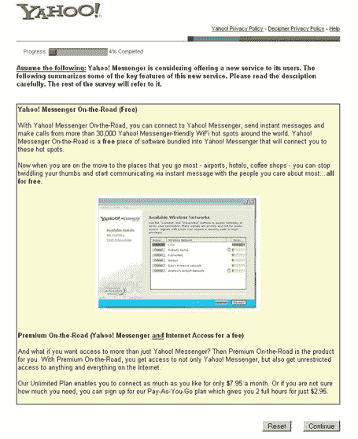

# 雅虎测试免费 Wifi 产品 

> 原文：<https://web.archive.org/web/http://www.techcrunch.com:80/2006/04/18/yahoo-testing-free-wifi-product>

# 雅虎测试免费 Wifi 产品

  [雅虎](https://web.archive.org/web/20230217090843/http://www.yahoo.com/)不仅仅是[测试一个新的主页布局](https://web.archive.org/web/20230217090843/https://techcrunch.com/2006/04/18/yahoo-testing-new-home-page-layout/)——他们也在测试一个新的有选择的用户的 wifi 服务。

调查(下面的截图)表明[雅虎的新信使产品](https://web.archive.org/web/20230217090843/https://techcrunch.com/2006/03/21/new-voip-yahoo-messenger-launches-tomorrow/)将能够访问某些 wifi 网络，并允许即时通讯和 VOIP 通话(这是假设这些网络以某种方式受到限制)。他们没有说出可能合作的网络，但表示:

> 现在，当您在旅途中去您最常去的地方时——机场、酒店、咖啡馆——您可以不再闲荡，开始通过即时消息与您最关心的人交流——所有这些都是免费的。

如果这项服务上线，你还可以每月花 7.95 美元无限制地访问这些网络，或者花 2.95 美元访问两个小时。

下面的屏幕截图。感谢 Razvan 的提示。

