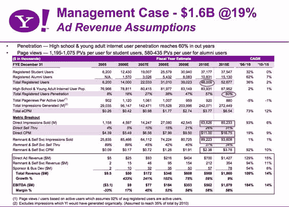
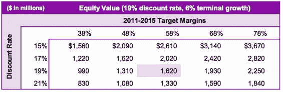

# 雅虎“项目兄弟会”文件泄露 TechCrunch

> 原文：<https://web.archive.org/web/http://www.techcrunch.com:80/2006/12/12/yahoos-project-fraternity-docs-leaked>

今年大部分时间里，关于脸书 T2 可能被收购的传言一直围绕着 T4。不是雅虎或脸书要求这种关注，而是媒体变得坐立不安。罗伯特·扬上周说得很好，他问道——[雅虎&脸书:交易还是不交易？](https://web.archive.org/web/20221231013920/http://gigaom.com/2006/12/08/yahoo-facebook/)。这当然是本财季的问题。

我们知道，几乎从一开始，脸书就一直被追逐。2004 年年中，就在他们从 Accel Partners 获得第一轮融资的几个月前，他们侥幸躲过了 Friendster 1000 万美元的收购。Friendster 前高管表示，交易接近完成，但最后一刻关于控制权的谈判最终中断了交易。从那以后，每一家主要的互联网公司都与脸书进行了接洽。

在雅虎，这场旷日持久的恋爱至少持续到了今年，内部称之为“博爱工程”。我们掌握的泄露文件显示，早在 2006 年，Q1 的早期报价是 3750 万美元，收购该公司 5%的股份(估值为 7.5 亿美元)。这遭到了脸书的拒绝。

年中事情变得非常激烈。雅虎根据他们创建的模型提出了 10 亿美元的收购价格，他们预计到 2009 年脸书收入将达到 6.08 亿美元，到 2010 年将增长到 9.69 亿美元。到 2015 年，雅虎预计脸书将产生近 10 亿美元的年利润。2006 年的实际数字似乎约为 5000 万美元的收入，或每周近 100 万美元。

这些收入预测是基于强劲的用户增长。雅虎预计，到 2010 年，脸书的高中生和年轻人总数将达到 8300 万，用户将达到 4800 万。

我们的消息来源称，脸书断然拒绝了 10 亿美元的报价，希望得到更多。雅虎准备支付高达 16.2 亿美元，但谈判在报价前破裂。

这些文件已经有几个月了，在此期间，雅虎和脸书可能都改变了对可能交易的看法。

