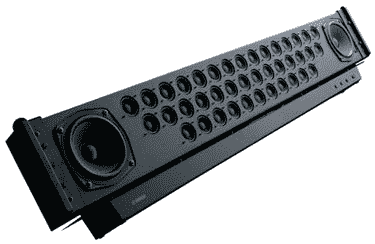

# 雅马哈 YSP-1100 | TechCrunch

> 原文：<https://web.archive.org/web/http://techcrunch.com/2006/09/19/yamaha-ysp-1100/>

# 雅马哈 YSP-1100

雅马哈 YSP-1100 是一个很棒的系统，它有 40 个独立的 1 英寸驱动器，可以模拟环绕声体验。该设备支持杜比和 DTS 格式，以实现最大的多功能性。它似乎提供了所有的商品，而没有电缆、扬声器安装或客厅杂乱的麻烦。

雅马哈 YSP-1100 的另一个伟大的功能是它的夜间听力增强模式，它允许安静的声音(尤其是对话)被听到水晶般清晰，没有音量。如果你想知道这个东西是否能在房间的任何地方投射环绕声，看看这个:

> 有五种可选的声音设置，允许用户在 5 波束模式、立体声模式、3 波束模式、立体声+3 波束模式和我的波束模式之间进行选择。YSP-1100 比它的前辈有一个更宽的音场，在一个房间里提供更多的最佳聆听位置。我的波束模式允许用户通过触摸按钮将声音聚焦到他们房间的特定位置，以避免打扰他人。

雅马哈 YSP-1100 是一个性感和负荷，但有点昂贵-她将在货架上为 1700 美元。如果你想到产品的特点，我想它不会太糟糕。

[雅马哈 YSP-1100](https://web.archive.org/web/20130627212528/http://gizmodo.com/gadgets/home-entertainment/yamaha-ysp1100-flat-panel-shoots-surround-201737.php)