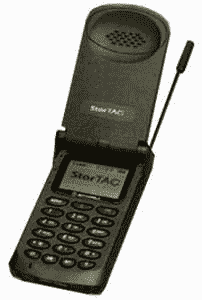

# Ye Olde 无线互联网| TechCrunch

> 原文：<https://web.archive.org/web/http://techcrunch.com/2007/06/21/ye-olde-wireless-internet/>

作为一个科技博客，我们在最新的设备和服务上领先于我们的笔记本电脑。很自然，威瑞森(贝拉兰特、GTE 和 AirTouch 的混血儿)一推出新的“无线网络”服务，我们就成了第一批用手机上网的人。没错，没错，起初我们也为这怎么可能感到震惊，但显然这是一项迅速发展的技术。

在我们的测试中，在 StarTAC 上查看电子邮件是一种愉快的体验。极客信条的一大好处是:能够在旅途中保持与收件箱的连接。

请在此阅读第三方对服务和《快乐 21 世纪》的评论。