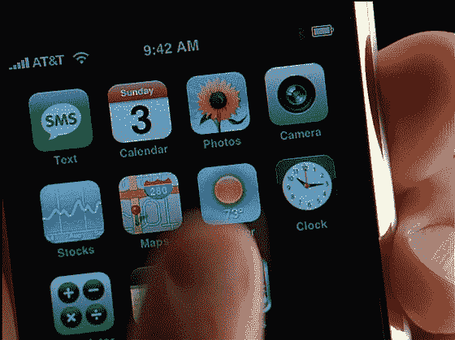

# 是的，但是这和 iPhone 有什么关系呢？

> 原文：<https://web.archive.org/web/http://www.techcrunch.com:80/2007/06/04/yes-but-what-does-that-have-to-do-with-the-iphone/>

# 是的，但是这和 iPhone 有什么关系呢？

昨天我和记者史蒂夫·吉尔默共进午餐。我希望他能对我正在做的谷歌/销售力量的报道有所帮助，所以我们在旧金山机场附近我们最喜欢的地方见了面。但他开玩笑地回答了我所有的问题，“是的，但这和 iPhone 有什么关系？”他的观点是，iPhone 将在今年改变一切，这是他想谈论的全部内容。特别是，它改变了我们对计算机和设备集成的看法。

截至 6 月 29 日，即 iPhone 的发布日，这两款设备将真正成为一个集成的计算设备——当你离开家时，你只需带走其中的一部分。如果你看了今天发布的新的 [iPhone 电视广告](https://web.archive.org/web/20211127053636/http://www.apple.com/iphone/ads/)，仍然不相信，那么我想听听为什么。

围绕 iPhone 的真正炒作甚至还没有开始。我迫不及待地想把这些东西拿在手中。我期待 6 月 29 日在这里发布的帖子，因为我和团队的其他成员很可能会排很长的队，等待获得这些非常昂贵的小工具中的一个。