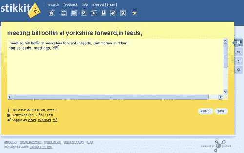
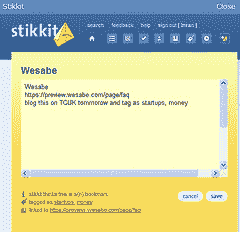

# 你知道在哪里缝合；)| TechCrunch

> 原文：<https://web.archive.org/web/http://techcrunch.com/2006/11/08/you-know-where-to-stikkit/>

今天晚些时候，在奥莱利的 [Web 2.0](https://web.archive.org/web/20160316010345/http://www.web2con.com/) 会议上，总部位于波特兰的 [Values of n](https://web.archive.org/web/20160316010345/http://www.valuesofn.com/) 将推出该公司的首次服务 [*Stikkit*](https://web.archive.org/web/20160316010345/http://www.stikkit.com/) 的测试版。从今年春天开始，我就一直在关注这家公司的进展，主要是因为我很好奇前 O'Reilly 首席技术官 Rael Dornfest 对他的最新企业有什么计划。事实上，该团队拥有杰出的血统，贡献者来自 Orange、O'Reilly 和 Platial 等公司。

雷尔将 Stikkit 描述为“你生活的命令行”和他所谓的“持续部分组织”的工具——一种试图完成事情的持续状态。Stikkit 本质上是一个记事本，它试图理解你的笔记，并将它们自动组织成有用的应用程序，如日历、待办事项列表和书签……有点像 Gina Trapani 的 *[Todo.txt](https://web.archive.org/web/20160316010345/http://todotxt.com/)* 的复杂迭代。当然，每个条目都可以与其他 Stikkit 用户共享。那么它的效果如何呢？

为了给今天晚些时候的会议添加一个日历条目，我简单地输入了*“明天上午 11 点，在利兹约克郡福沃德会见比尔·博芬”，标签为“YF 利兹会议”*。

为了给一个浏览器页面添加书签，我点击了书签小程序，并在预先插入的 URL 和页面标题中添加了*‘明天在 TCUK 上写博客，并标记为 money，startup’*。

当用户输入他们的笔记时，Stikkit 试图将条目识别为事件、书签或待办事项；它正确地识别了前两项，但不幸的是，待办事项列表需要手动识别。然而，这种即时反馈是学习服务词汇和语法的强大机制；当你打字时，简单地提及人物、地点和时间，就可以开始构建你的思维。那是非常酷的

Stikkits 还可以触发诸如询问其他用户的日记、发布博客和创建提醒等动作。使用半自然语言来创建结构化数据，对于任何数量的服务来说，都可能是一个强大而有吸引力的接口。

苹果的 *[聚光灯](https://web.archive.org/web/20160316010345/http://www.apple.com/macosx/features/spotlight)* ，乔纳森·阿基诺的 *[Yubnub](https://web.archive.org/web/20160316010345/http://yubnub.org/)* ， [*背包*](https://web.archive.org/web/20160316010345/http://www.backpackit.com/) *，AIM 机器人*，*谷歌*甚至短信代码都为命令行的复兴做出了贡献，看起来 *Stikkit* 将继续这一趋势。我喜欢这样一个概念的可能性，特别是在寻求将我们经常模糊的冲动规范化的过程中。不难看出用户体验的强大之处，例如驱动移动操作系统的 Stikkit，类似 SMS 的简短命令可以克服移动用户界面的限制，同时仍然允许用户用丰富的数据填充他们的移动应用程序。

看看 n 的*值将服务发展到什么程度，以及将会出现哪些商业模式，这将会很有趣。该公司计划在用户现有的习惯内工作，因此 Stikkits 可能被用来操纵*[*谷歌日历*](https://web.archive.org/web/20160316010345/http://www.google.com/pagead/iclk?sa=l&ai=Bbj1GuD9RRd_WDZ_O-gKIi82qDcqlvxO69cqOAt6byJMJkE4IABABGAE4AECKFkiiOVCHxZ6K-_____8BYLu-roPQCpgBmoUBoAHen8z7A6oBE2NvbS5taWNyb3NvZnQ6ZW4tVVPIAQGVAgnUXgo&adurl=https://www.google.com/accounts/ServiceLogin%3Fservice%3Dcl%26passive%3Dtrue%26nui%3D1%26continue%3Dhttp%253A%252F%252Fwww.google.com%252Fcalendar%252Frender%253Fhl%253Den_GB%26utm_campaign%3Den_GB%26utm_source%3Den_GB-ha-emea-uk-google%26utm_medium%3Dha%26utm_term%3Dgoogle%2520calendar%26hl%3Den_GB)[*Outlook*](https://web.archive.org/web/20160316010345/http://www.microsoft.com/outlook/)[*del . icio . us*](https://web.archive.org/web/20160316010345/http://del.icio.us/)等——对任何人的*服务来说，这是一个引人注目的、直观的和不可知的用户界面。干得好，雷尔。***