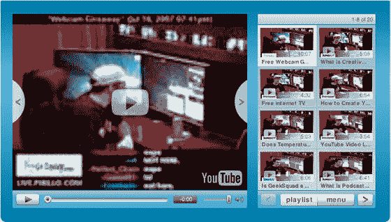

# YouTube:现在有了可定制的播放器——TechCrunch

> 原文：<https://web.archive.org/web/http://www.techcrunch.com:80/2007/07/20/youtube-launches-custom-player-feature/>

# YouTube:现在有了可定制的播放器

 [YouTube](https://web.archive.org/web/20211205084924/http://www.crunchbase.com/company/youtube) 推出了一项新的“定制播放器”功能，允许用户定制嵌入的 YouTube 视频。

用户可以自定义播放器的特性，包括播放器的名称、颜色主题、布局(标准布局或右边有相关视频的布局)和内容。

内容功能允许用户包含自己的视频或 YouTube 收藏夹列表或 YouTube 播放列表中的其他视频。

例子如下。由于宽度的考虑(780 像素宽)，我们无法将播放器和相关视频嵌入到右侧，但缩小的屏幕截图显示了它的样子。下面是 Chris Pirillo 的自定义嵌入，我还要感谢他的提示。

新功能可在[youtube.com/custom_player](https://web.archive.org/web/20211205084924/http://www.youtube.com/custom_player)访问。

[http://www . YouTube . com/CP/vjvqa 1 pcfoi 2 gvext 8 xyjgvnfb 0 fary 6 epk 1 kmgxa =](https://web.archive.org/web/20211205084924/http://www.youtube.com/cp/vjVQa1PpcFOi2GvexXT8XYJgvnFB0faRy6epK1KmGxA=)