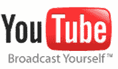

# YouTube 推出收入共享合作伙伴计划，但没有预售

> 原文：<https://web.archive.org/web/http://www.techcrunch.com:80/2007/05/04/youtube-launches-revenue-sharing-partners-program-but-no-pre-rolls/>

# YouTube 推出收入共享合作伙伴计划，但没有预卷

首先由[奥姆·马利克](https://web.archive.org/web/20230307220020/http://newteevee.com/2007/05/03/youtube-starts-paying-star-users/)发布，现在在 [YouTube 博客](https://web.archive.org/web/20230307220020/http://youtube.com/blog?entry=4b3PkL8HQcw)上直播的消息是，YouTube 已经为其顶级内容创作者推出了收入共享合作伙伴计划，这是一项积极的进步，尽管收购价格为[15 亿美元](https://web.archive.org/web/20230307220020/https://techcrunch.com/2006/09/21/youtubes-magic-number-15-billion/)，但这项服务去年仅获得[1500 万美元的收入](https://web.archive.org/web/20230307220020/https://techcrunch.com/2007/03/06/youtube-revenues-15-million-per-year-or-per-month/)。

公告中明显缺少的是 YouTube 新合作伙伴的预投影片或类似的视频广告，其中包括 [LisaNova](https://web.archive.org/web/20230307220020/http://www.youtube.com/profile?user=LisaNova) 、 [renetto](https://web.archive.org/web/20230307220020/http://www.youtube.com/profile?user=renetto) 、 [HappySlip](https://web.archive.org/web/20230307220020/http://www.youtube.com/profile?user=HappySlip) 、 [smosh](https://web.archive.org/web/20230307220020/http://www.youtube.com/profile?user=smosh) 和 [valsartdiary](https://web.archive.org/web/20230307220020/http://www.youtube.com/profile?user=valsartdiary) 。

我们已经报道了关于引入视频广告的传言[之前](https://web.archive.org/web/20230307220020/https://techcrunch.com/2007/01/29/youtube-delivers-knock-out-punch-to-competitors/)，在一月份，Steve Poland 提到 BBC 的报道，YouTube 上的广告可能会采用 3 秒钟的预播放形式，但大约 4 个月后，仍然没有。

如果不是因为 YouTube 不仅没有给谷歌带来巨大的财务投资回报，而且新的合作伙伴计划也只是通过 Adsense 单元将实际的 YouTube 页面目的地货币化，我们就可以把它留在那里。尽管并非一无是处，但考虑到 YouTube 内容的消费方式，这个新项目还是有局限性的。YouTube 最早的优势是在外部网站上使用嵌入式视频:大量(如果不是大多数的话)观众永远不会看到广告，只会在博客和论坛上观看，如果他们运行 Google Adsense 单元，这样做的方式对内容创作者不利。

红鲱鱼[在 4 月](https://web.archive.org/web/20230307220020/http://www.redherring.com/Article.aspx?a=22095&hed=YouTube+Lining+Up+Summer+Ads)报道称，YouTube 正在寻求在夏季推出预投影片，但仅限于优质出版商内容。虽然优质内容是 YouTube 流量的强大驱动力，但 YouTube 在引入视频广告时对它的唯一关注将忽略用户生成和提交内容的长尾，这是谷歌及其正式内容分发协议之前的日子里该网站的真正驱动力，许多人会认为现在仍然如此。

问题自然是为什么？为什么不向所有 YouTube 内容创作者推出视频内/前置广告选项？虽然广告可能不会受到每个人的欢迎，但谷歌知道广告市场，它可以将迄今为止的财务成功归功于它对内容创作者的包容性拥抱:谷歌 Adsense 今天保持着明显的领先地位，因为世界各地的出版商不仅接受了该计划，而且实际上能够参与其中，雅虎的 YPN 仍然是一项邀请/美国出版商专用的服务，微软 AdCenter 嗯……在那里，但在接受长尾方面没有做任何事情。

如果技术是罪魁祸首，因为谷歌仍然没有解决视频广告背后的技术问题，你会问为什么会推迟，这是谷歌的巴拿马吗？谷歌视频在收购 YouTube 之前就已经存在了，所以他们并不是从 9 月份才让[开始这项技术的工作，而且考虑到包括](https://web.archive.org/web/20230307220020/https://techcrunch.com/2006/09/21/youtubes-magic-number-15-billion/) [Revver](https://web.archive.org/web/20230307220020/http://www.revver.com/) 等网站在内的较小的初创公司也可以做到这一点……我想再进行一次面向视频的收购的可能性总是很小。