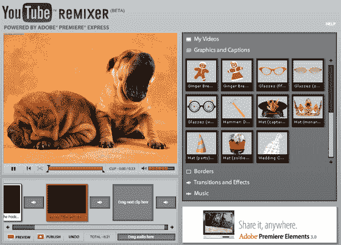

# YouTube Remixer:在 YouTube 上在线编辑视频 TechCrunch

> 原文：<https://web.archive.org/web/http://www.techcrunch.com:80/2007/06/16/youtube-remixer-edit-videos-online-at-youtube/>

# YouTube Remixer:在 YouTube 上在线编辑视频

 [YouTube](https://web.archive.org/web/20221003141127/http://www.beta.techcrunch.com/tag/youtube) 正式推出了 [YouTube Remixer](https://web.archive.org/web/20221003141127/http://www.youtube.com/ytremixer) ，这是一项新服务，允许用户在 YouTube 内部编辑他们的视频。

这项新功能由 Adobe Premiere Express 提供支持，支持插入图形、文本和音频，以及叠加和视频过渡。YouTube Remixer 与 Photobucket 的 Remix 工具几乎相同；两者都由 Adobe 驱动。

这不是一个会被严肃的内容创作者所接受的产品，但是对于偶尔上传 YouTube 的人来说是理想的。界面相当简单，如果可能有点沉闷和无聊。在 YouTube 上创建一个所有视频的一站式商店是一个自然的发展路径，给了消费者另一个在网站上花更多时间的理由；只是它是灰色的，没有灵感，非常不像谷歌。我也找不到在我的视频中加入姜饼人的个人诉求；然而，其他人可能会对这项服务有不同的看法。
