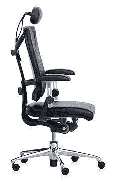

# Ypsilon 办公椅| TechCrunch

> 原文：<https://web.archive.org/web/http://techcrunch.com/2006/10/18/ypsilon-office-chair/>

Gadgetizer 的男孩们写了一篇关于一种新产品的独家新闻，这种新产品可能会出现在任何地方的豪华办公室里。Ypsilon 办公椅——我猜它的发音是“Epsilon”，但我觉得必须说“Yip-silon”——提供 10 种可调设置，包括座位、靠背和头枕的高度、深度和压力。除了它的治疗功能，它看起来从光滑。

外观方面，Ypsilon 让我想起了牙医的椅子。这显然是针对 Aeron 市场，但我不知道它是否足以推翻国王的椅子。不过，我不介意试一试。

[Ypsilon 办公椅，有 10 种可调设置](https://web.archive.org/web/20150919132653/http://www.gadgetizer.com/2006/10/18/ypsilon-office-chair-with-10-adjustable-settings/)