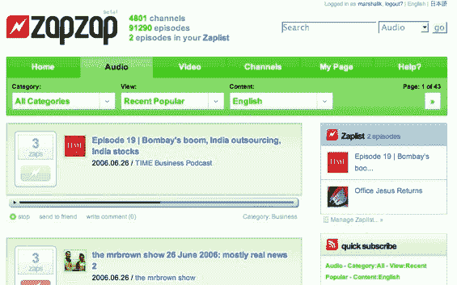

# ZapZap 做好了社交播客目录

> 原文：<https://web.archive.org/web/http://www.techcrunch.com:80/2006/06/26/zapzap-does-social-podcast-directories-right/>

 [ZapZap](https://web.archive.org/web/20150919103714/http://www.zapzap.com/) 是日本一个新的音频和视频播客目录服务，本周末刚刚推出。虽然播客目录推出速度很快，但这个目录特别好。Ajax 用得恰到好处，digg 式投票是核心，与 iTunes 同步或在网站上播放。美学是有吸引力的，有英语和日语部分的网站。

ZapZap 的创造者是一个不敬的 25 岁名叫乔恩·安东尼·杨福科克尔，出生在英格兰，住在东京。

你不得不考虑这样的网站如何将自己与其他提供类似功能的网站区分开来。ZapZap 确实有一个完整的功能集，它看起来很棒，并且有两种语言版本，这是一个明智的举动。我最近看到的唯一一个 ZapZap 没有提供的东西是一个 javascript bookmarklet，它可以将一个离线播客标记到你的个人档案中，就像 [Pluggd](https://web.archive.org/web/20150919103714/http://pluggd.com/) 提供的一样(参见[对 Pluggd](https://web.archive.org/web/20150919103714/http://www.techcrunch.com/2006/06/22/pluggd-podcast-community-opens-for-use/) 的评论)。标签也不用于分类播客；当规模化成为一个问题时，这是 ZapZap 正在考虑的一个步骤，当产品数量增加时，找到播客可能会变得越来越困难。

这里的小细节很不错。每次你订阅的播客发布新的一集，就会收到一个“zap”投票。用电子邮件把一集的链接发给某人很容易。订阅很简单。在 iTunes 中提供订阅链接而不是试图与 iTunes 竞争是明智的。功能非常流畅。

目前还没有明显的商业模式。文本广告可以出现在页面上。一般来说，如果我再看到一个播客目录，我会很生气，但是这个目录真的很好。

